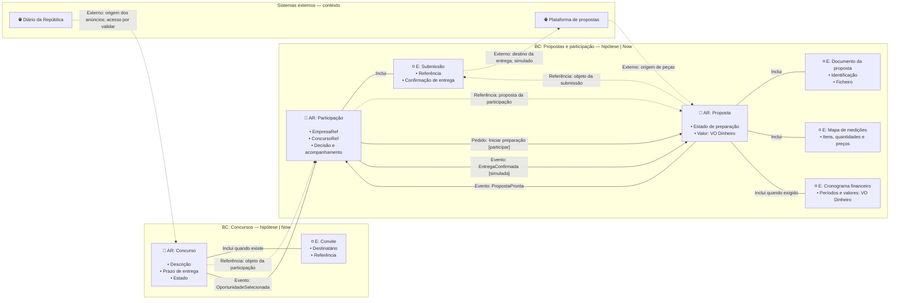

# Fluxo DDD de entidades e agregados

## O que modela

A estrutura proposta do domínio e a colaboração entre agregados. Combina **bounded contexts (BC), raízes de agregado (AR), entidades de suporte, Value Objects (VO), referências e interações**. Não é apenas uma lista de conceitos agrupados por prioridade nem um workflow de tarefas.

Ao usar este formato, cumprir a notação descrita abaixo. O formato é fixo; o conteúdo e as fronteiras podem ser hipóteses. Não omitir a classificação por estar por validar: indicar o estatuto no título do BC e na legenda.

- **BC:** âmbito em que a linguagem e as regras têm significado consistente; não equivale a um ecrã, prioridade, pasta ou microserviço.
- **Agregado:** conjunto de conceitos cujas invariantes são protegidas como uma unidade de consistência.
- **AR:** entidade que controla as alterações e invariantes de um agregado. Um BC pode conter vários agregados.
- **Entidade (E):** conceito com identidade e continuidade. Uma entidade não marcada AR é suporte de um agregado neste modelo.
- **VO:** valor definido pelos atributos, sem identidade própria; por exemplo, `Dinheiro` com montante e moeda. Pode ser caixa ou tipo de uma propriedade.
- **Core domain:** classificação estratégica, não sinónimo de «maior BC». Só incluir essa classificação com uma decisão sustentada; não inventá-la para preencher a notação.

## Notação obrigatória

- `flowchart LR`.
- `subgraph BC_X["BC: Nome — hipótese | prioridade"]` para cada contexto de domínio. Prioridade é metadado: nunca substitui o BC.
- `🔷 AR: Nome` nas raízes, seguido de propriedades em linhas `•`, quando relevantes.
- `◽ E: Nome` nas entidades de suporte; `▫ VO: Nome` nos valores representados como caixas. Valores embutidos usam `propriedade: VO Nome`.
- `AR ---|"Inclui"| E` ou `VO`: composição proposta. Cada entidade de suporte tem uma raiz proprietária identificável; uma ligação entre duas raízes não é composição.
- `A -. "Referência: relação" .-> B`: associação por referência, incluindo referências entre agregados. Não implica alteração transacional conjunta.
- `AR -->|"Evento: FactoOcorrido"| AR`: comunicação de um facto relevante para outro agregado.
- `AR -->|"Pedido: Ação"| AR`: interação proposta. Indicar condições quando necessárias. Eventos e pedidos não são nomes de entidades nem fases adicionais do workflow.
- Sistemas externos identificados por `🌐`, `🖥️`, `📊` ou `✉️`, num grupo separado. Ligações tracejadas têm rótulo `Externo:` e descrevem origem, destino ou ferramenta; não provam integração.

Composição diz quem gere o conceito **nesta hipótese**. Ainda é necessário validar identidade, invariantes, concorrência, volume e ciclo de vida antes de aprovar a fronteira. Um evento desenhado não exige event bus, microserviço ou automatização; pode corresponder a coordenação local ou a uma ação humana.

## Exemplo

Fronteiras e interações hipotéticas. «Proposta» inclui os seus elementos de preparação; «Participação» controla a decisão e o registo da entrega. O diagrama não valida uma integração externa ou uma regra jurídica.

## Relação com as outras vistas

O [percurso principal](main-entity-flows.md) é uma projeção simplificada das entidades e referências, não uma repetição de todos os BC e eventos. Usa os mesmos nomes e relações; a omissão dos marcadores DDD nessa vista simplificada é intencional, não uma dispensa para a vista detalhada.

O [workflow](workflow-flows.md) explica as ações das pessoas. Os [estados](state-diagrams.md) explicam o ciclo de uma entidade. Um rótulo «Evento: PropostaPronta» aqui comunica um facto entre agregados; não transforma «PropostaPronta» numa nova caixa de entidade.

## Como rever

- Todos os conceitos de domínio estão num BC e classificados como AR, E ou VO? Cada BC apresenta o estatuto das fronteiras?
- As entidades de suporte têm um caminho de composição até uma única raiz? Referências não foram confundidas com composição?
- VO embutidos têm o tipo explícito? Identidade e ciclo de vida justificam as classificações propostas?
- Os eventos ligam raízes, descrevem factos e têm condições relevantes? Os pedidos distinguem-se dos eventos?
- A hipótese de cada agregado descreve as invariantes que precisará de proteger, sem as tratar como decisões aprovadas?
- Quando houver vistas relacionadas, os nomes e relações estruturais permanecem coerentes entre elas?
- Sistemas externos estão fora dos BC de domínio e as ligações são identificadas como `Externo:`?
- Não existe uma caixa de estado como «Aguarda resultado» fingindo ser entidade?
- Prioridades, limites de simulação e hipóteses não foram transformados em decisões de produção?
