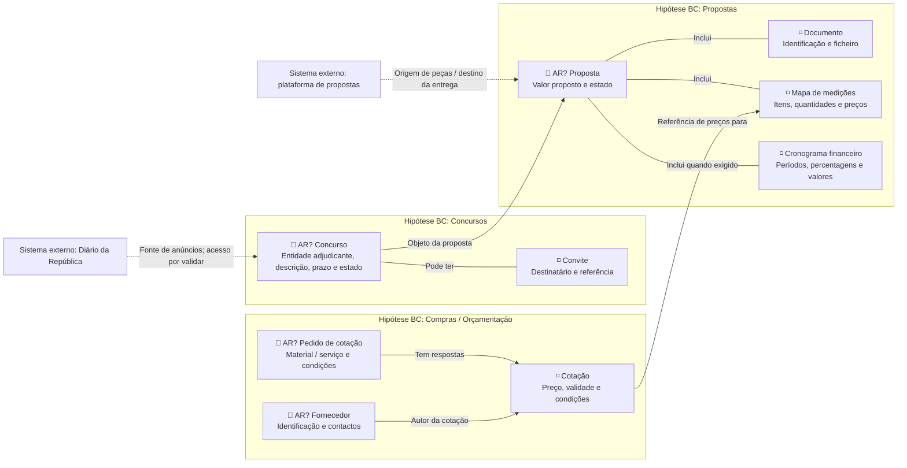

# Fluxo detalhado de entidades e agregados

## O que modela

Os conceitos do domínio, os seus atributos relevantes e as relações entre eles. Usa a mesma notação do [percurso principal](main-entity-flows.md), mas inclui entidades de suporte e relações laterais. As setas não estabelecem ordem temporal de execução.

Quando houver evidência suficiente, pode também representar hipóteses DDD (Domain-Driven Design):

- **Entidade:** conceito com identidade e continuidade, mesmo quando os atributos mudam.
- **Value Object (VO):** valor definido pelos seus atributos, sem identidade própria; por exemplo, `Dinheiro` com montante e moeda.
- **Agregado:** conjunto de conceitos cujas regras de consistência são protegidas como uma unidade.
- **Raiz do agregado (AR):** entidade pela qual se acede e altera esse agregado.
- **Bounded Context (BC):** âmbito em que termos e regras têm um significado consistente. Não é sinónimo de pasta, módulo visual ou microserviço.

Esses papéis não decorrem automaticamente de ter uma caixa no diagrama. Só marcar AR/BC quando forem decisões confirmadas ou hipóteses explicitamente identificadas. Não declarar «core domain» apenas porque uma área aparece no centro do desenho: isso exige uma decisão sobre valor estratégico.

## Notação

- `flowchart LR`: vista horizontal de entidades e relações.
- Caixa com nome e atributos: informação relevante, não schema de base de dados nem lista definitiva de campos.
- `A -->|"Relação"| B`: relação dirigida e nomeada, não passagem obrigatória à etapa seguinte.
- `A ---|"Inclui"| B`: associação/composição conceptual; por si só não confirma pertença a um agregado.
- `subgraph`: agrupamento visual. O rótulo deve dizer se é área, prioridade ou hipótese BC.
- `🔷 AR?`: raiz candidata, não decisão aprovada. `◽` identifica uma entidade de suporte nesta legenda, sem decidir a sua propriedade.
- Linha tracejada: contexto externo neste exemplo, não transporte de eventos nem integração implementada.

## Exemplo

Hipóteses ilustrativas. Os grupos não estabelecem a decomposição atual do Cairn; Documento dentro do grupo não valida a sua pertença transacional à Proposta.

## Relações não são eventos

Uma ligação `Concurso → Proposta` pode significar «objeto da proposta». Não significa automaticamente que um evento `ConcursoSelecionado` cria uma Proposta. Se precisar de representar coordenação por eventos, fazer uma vista separada, com legenda explícita de eventos, emissores, destinatários e efeitos esperados. Não adicionar caixas como «Aguarda resultado» à vista de entidades: isso é estado ou tarefa, não uma nova entidade por si só.

## Como rever

- Todos os nós de domínio representam conceitos, não ações como «Criar planeamento» ou «Alocar equipa»?
- Todas as ligações relevantes têm um significado explícito?
- Existem relações de suporte além do caminho principal, sem duplicar o workflow?
- Relações e nomes partilhados com o percurso principal são consistentes?
- Proposta de agregado tem invariantes e necessidades de consistência a validar, em vez de resultar só da disposição visual?
- Dependências temporais e transmissão de eventos foram separadas das relações estruturais?
- Ferramentas externas estão identificadas como contexto, não entidades do produto?
- A vista não promove Gantt de Maybe a Later nem transforma exemplos em requisitos confirmados?
