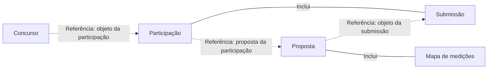

# Percurso principal entre entidades

## O que modela

Uma projeção estrutural reduzida da [vista DDD de entidades e agregados](entity-aggregate-flows.md). Mostra os conceitos e relações necessários para explicar o caminho principal, incluindo elementos de suporte ou VO relevantes, sem toda a colaboração entre agregados.

Esta simplificação conserva a convenção acordada para o percurso principal: **relações entre conceitos, não tarefas nem transições de estados**. As interações por eventos/pedidos ficam na vista DDD; as ações do utilizador ficam no [workflow](workflow-flows.md). Não aplicar esta simplificação à secção detalhada «Entidades».

## Notação obrigatória

- `flowchart LR`.
- Caixas com os mesmos nomes da vista detalhada, sem os prefixos DDD, grupos BC ou propriedades não essenciais. A classificação original continua a existir na vista detalhada.
- `A ---|"Inclui"| B`: mesma composição proposta da vista detalhada.
- `A -. "Referência: relação" .-> B`: mesma referência estrutural da vista detalhada; conservar nome e direção.
- Sem eventos/pedidos, caixas de espera, decisões, tarefas ou sistemas externos no percurso estrutural reduzido.
- Indicar se a vista cobre Now ou o sistema; o fim do desenho não significa o fim do produto nem de um ciclo de vida.

## Exemplo

Projeção do exemplo da vista DDD detalhada, sem inventar relações, promover componentes a raízes ou impor uma sequência de ações.

Fornecedores, cotações, stock, cronogramas e recursos podem surgir numa vista do sistema sem pertencer ao caminho mínimo Now. Não acrescentar estes conceitos apenas para copiar o âmbito de um exemplo. Se a sequência ou coordenação entre agregados for a questão, consultar workflow ou vista DDD, respetivamente.

## Como rever

- Os conceitos, nomes e relações são um subconjunto da vista detalhada, com a mesma direção e tipo de ligação?
- A omissão dos prefixos e atributos é apenas visual, sem mudar identidade, composição ou propriedade?
- Inclui só os conceitos necessários ao percurso escolhido?
- Cada linha é uma composição ou referência, não tarefa, evento ou transição de estado?
- Os casos condicionais continuam explícitos nos rótulos relevantes?
- Âmbito e limites estão claros, sem declarar conclusão de um ciclo por terminar a vista?
