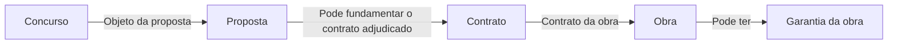

# Percurso principal entre entidades

## O que modela

Um subconjunto das entidades e relações que torna o caminho principal compreensível. Usa a mesma notação da [vista detalhada de entidades](entity-aggregate-flows.md), sem todos os atributos, conceitos de suporte ou relações laterais.

É um flowchart de entidades, não uma sequência de tarefas. «Concurso», «Proposta» e «Obra» são conceitos; «Selecionar concurso», «Planear» e «Executar tarefas» são ações para o [workflow](workflow-flows.md).

## Notação

- `flowchart LR`: percurso horizontal entre conceitos.
- Caixas com nomes de entidades; apenas os atributos necessários para compreender o percurso.
- Setas com relações, como «objeto da proposta», «base da obra» ou «garantia da obra».
- Sem marcas AR/BC por defeito: usar apenas se as fronteiras forem conhecidas ou explicitamente propostas.
- Sem caixas de espera, decisões ou eventos intermediários usados como falsas entidades.

## Exemplo

Vista reduzida ilustrativa do sistema, não cobertura de Now nem modelo aprovado de agregados. A relação com Contrato só existe no caso correspondente; não afirma que todas as propostas originam contrato ou obra.

Fornecedores, cotações, stock, cronogramas e recursos podem ser relevantes na vista detalhada sem pertencer ao caminho mínimo escolhido. Se o objetivo for mostrar quando uma cotação é pedida ou como a obra fica bloqueada, usar workflow ou uma vista de eventos separada.

## Como rever

- Só inclui entidades necessárias para explicar o caminho escolhido?
- Os nomes e relações coincidem com os da vista detalhada, ou existe uma razão documentada para uma simplificação?
- As setas representam relações, não comandos como «Planear» nem eventos como «ObraConcluida»?
- Casos condicionais não parecem obrigatórios?
- Está claro se é uma vista Now ou do sistema mais amplo? O fim do desenho não afirma o fim do produto ou do wireframe.
