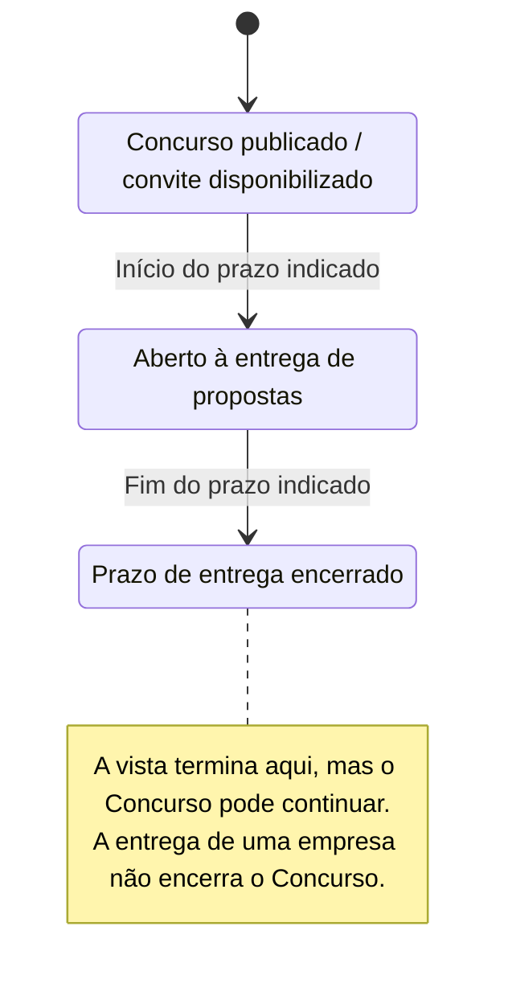
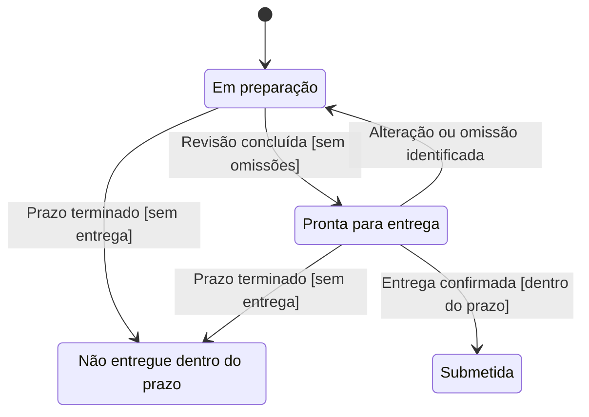

# Diagrama de estados

## O que modela

O ciclo de vida de **uma entidade ou agregado**, com estados, transições, eventos e condições. Não representa todos os passos do utilizador nem mistura o procedimento público com a participação de uma empresa.

Exemplo de distinção: um Concurso pode continuar aberto mesmo que uma empresa decida não concorrer. «Em preparação» pertence à Proposta ou Participação, não ao Concurso. «Em execução» e «Em garantia» pertencem à Obra. Modelar cada ciclo num bloco separado.

## Notação

- `stateDiagram-v2`: formato Mermaid de estados.
- `state "Nome legível" as Identificador`: estado e identificador local.
- `Origem --> Destino: Evento [condição]`: transição; a condição entre colchetes é uma convenção textual, não lógica executável.
- `[*] --> Estado`: entrada no ciclo representado.
- `Estado --> [*]`: estado final. Não usar para o mero fim de uma vista parcial.
- `Estado --> Estado: Evento`: evento tratado sem mudança de estado, quando útil.

## Exemplo — Concurso

Vista parcial ilustrativa, não sequência legal universal. O exemplo não obriga a existir uma fase «submissões ainda não abertas»: as datas e possibilidades dependem do procedimento.

## Exemplo — Proposta

Hipótese isolada de estados de uma Proposta; não decide se Proposta e Participação pertencem ao mesmo agregado. O prazo referido é o do Concurso relacionado. Submissão no protótipo é simulada; produção precisaria de confirmação externa verificável.

A ausência de estados finais neste exemplo não afirma que o ciclo esteja completo; acompanhamento, revisões e outros resultados ficam fora desta vista. Decidir não participar pode pertencer à Participação antes de sequer existir uma Proposta.

## Como rever

- Cada bloco tem um único sujeito? Uma empresa perder ou recusar não deve encerrar o Concurso.
- Os estados descrevem situações estáveis, não botões ou tarefas?
- Os rótulos das transições explicam o evento e as condições relevantes?
- O desenho distingue uma transição permitida de uma sequência obrigatória?
- A vista declara os resultados omitidos, como cancelamento ou ausência de adjudicação, em vez de inventar regras?
- Os estados finais indicam conclusão real do ciclo modelado, não apenas a última caixa desenhada?
