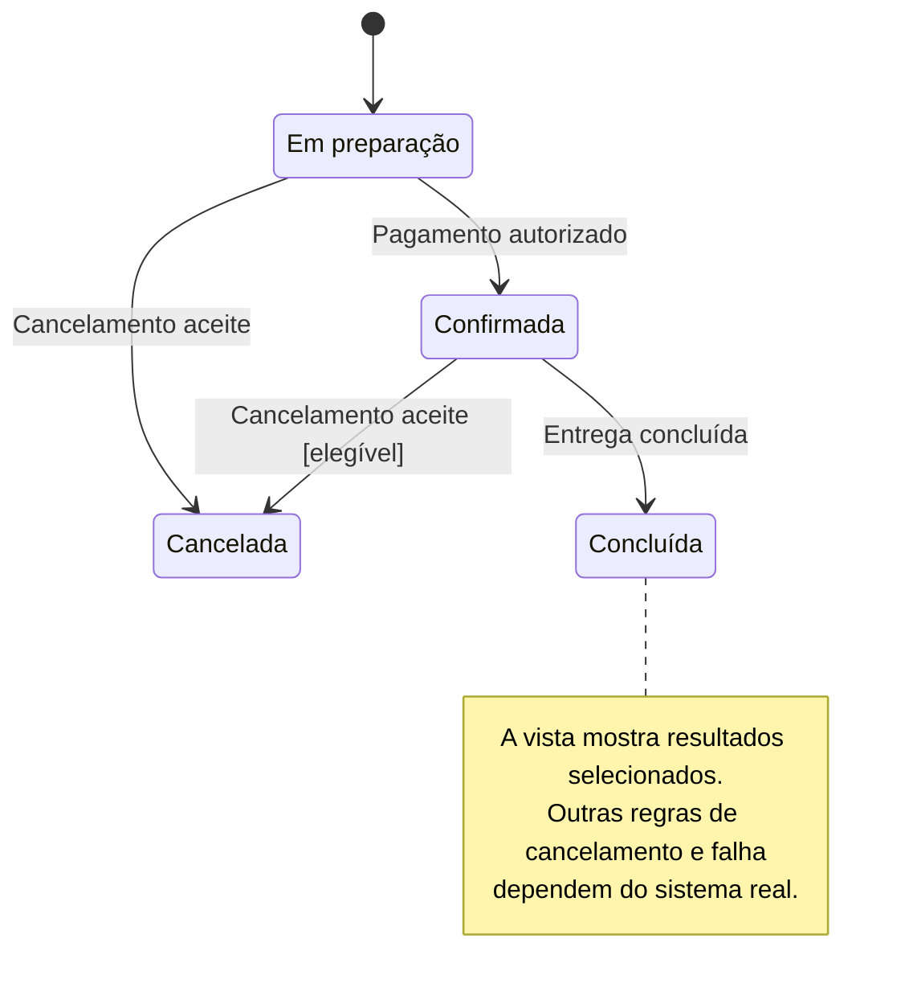
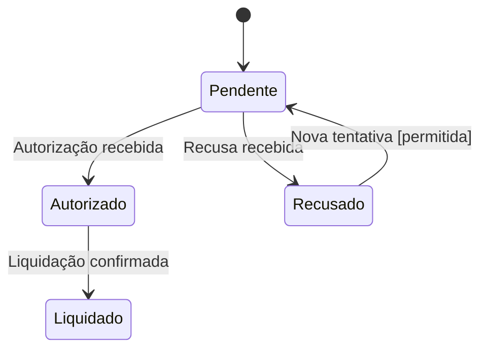

# Diagrama de estados

## O que modela

O ciclo de vida de **uma entidade ou agregado**, com estados, transições, eventos e condições. Não representa todos os passos do utilizador nem mistura ciclos de vida de sujeitos diferentes.

Por exemplo, o ciclo de vida de uma Conta é diferente do ciclo de vida de uma Subscrição: cancelar uma subscrição não implica necessariamente fechar a conta. Dar a cada sujeito um diagrama separado.

## Notação

- `stateDiagram-v2`: formato Mermaid de estados.
- `state "Nome legível" as Identificador`: estado e identificador local.
- `Origem --> Destino: Evento [condição]`: transição; a condição entre colchetes é uma convenção textual, não lógica executável.
- `[*] --> Estado`: entrada no ciclo representado.
- `Estado --> [*]`: estado final. Não usar para o mero fim de uma vista parcial.
- `Estado --> Estado: Evento`: evento tratado sem mudança de estado, quando útil.

## Exemplo — Encomenda

Vista parcial ilustrativa, não uma regra universal. Os eventos e as condições dependem das políticas do sistema real.

## Segundo exemplo — Pagamento

Hipótese simplificada de um ciclo de pagamento. Um pagamento recusado pode permitir uma nova tentativa, mas a política precisa de validação.

A ausência de estados finais não afirma que o ciclo esteja completo; estornos, expiração e outros resultados podem ficar fora desta vista.

## Como rever

- Cada bloco tem um único sujeito? Uma alteração num objeto relacionado não deve encerrar este ciclo sem uma regra explícita?
- Os estados descrevem situações estáveis, não botões ou tarefas?
- Os rótulos das transições explicam o evento e as condições relevantes?
- O desenho distingue uma transição permitida de uma sequência obrigatória?
- A vista declara os resultados omitidos, como cancelamento ou falha, em vez de inventar regras?
- Os estados finais indicam conclusão real do ciclo modelado, não apenas a última caixa desenhada?
