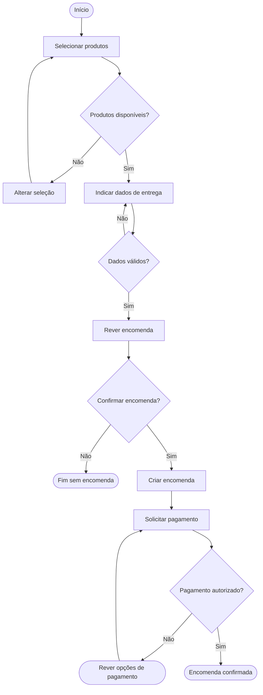

# Fluxo de trabalho

## O que modela

Ações, decisões e caminhos de uma pessoa ou processo: o que acontece, em que ordem, com que alternativas e retornos. É o formato apropriado para «Criar encomenda», «Rever dados», «Verificar disponibilidade» ou «Solicitar pagamento».

Não modela diretamente os estados de uma única entidade nem decide que as tarefas são módulos, entidades ou agregados de backend. Pode mostrar ações feitas fora do sistema modelado, desde que o responsável ou plataforma fique explícito.

## Notação

- `flowchart TD`: fluxo de cima para baixo.
- `A["Ação"]`: tarefa, preferencialmente com verbo.
- `D{"Pergunta?"}`: decisão; nomear as saídas, como «Sim» e «Não».
- `START(["Início"])` e `END(["Fim"])`: entrada e saída do percurso representado.
- `A --> B`: próxima ação possível.
- Ligação de retorno: revisão, repetição ou correção, com condição compreensível.
- Linha tracejada: consulta auxiliar opcional nesta legenda, não etapa obrigatória.
- `subgraph`: agrupamento por área ou responsabilidade; não implica um bounded context.

## Exemplo

Percurso pequeno de criação de uma encomenda, não uma política comercial completa. «Solicitar pagamento» representa uma ação no processo; não implica que uma integração esteja implementada.

Os caminhos de indisponibilidade, correção e recusa mostram resultados deste percurso fictício; um processo real pode ter outros passos e regras.

## Como rever

- Cada tarefa tem um objetivo e um responsável claros?
- Todas as decisões têm saídas identificadas? Os retornos podem chegar a um fim?
- O fluxo inclui erros, omissões, recusa ou expiração relevantes, sem inventar regras?
- As ações do sistema estão distinguidas das ações de utilizadores ou serviços externos?
- A sequência não é apresentada como universal se depende de uma política ou fonte?
- Ações não foram usadas como entidades na vista detalhada?
- Factos observados, regras e hipóteses estão claramente distinguidos?
