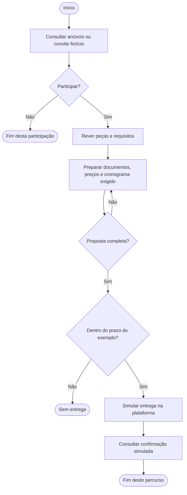

# Fluxo de trabalho

## O que modela

Ações, decisões e caminhos de uma pessoa ou processo: o que acontece, em que ordem, com que alternativas e retornos. É o formato apropriado para «Consultar anúncio», «Preparar proposta», «Verificar prazo» ou «Pedir cotação».

Não modela diretamente os estados de uma única entidade nem decide que as tarefas são módulos, entidades ou agregados de backend. Pode mostrar ações feitas fora do Cairn, desde que o responsável ou plataforma fique explícito.

## Notação

- `flowchart TD`: fluxo de cima para baixo.
- `A["Ação"]`: tarefa, preferencialmente com verbo.
- `D{"Pergunta?"}`: decisão; nomear as saídas, como «Sim» e «Não».
- `START(["Início"])` e `END(["Fim"])`: entrada e saída do percurso representado.
- `A --> B`: próxima ação possível.
- Ligação de retorno: revisão, repetição ou correção, com condição compreensível.
- Linha tracejada: consulta auxiliar opcional nesta legenda, não etapa obrigatória.
- `subgraph`: agrupamento por área ou responsabilidade; não implica um bounded context.

## Exemplo

Percurso pequeno de preparação, não processo legal completo. «Simular entrega» não acede a uma plataforma nem envia documentos; na operação real, a entrega acontece na plataforma autorizada.

A saída «Não participar» termina a participação desta empresa, não o Concurso. O fim deste exemplo não limita a experiência completa do protótipo a Now.

## Como rever

- Cada tarefa tem um objetivo e um responsável claros?
- Todas as decisões têm saídas identificadas? Os retornos podem chegar a um fim?
- O fluxo inclui erros, omissões, recusa ou expiração relevantes, sem inventar regras?
- Ações externas e ações simuladas estão distinguidas das operações do Cairn?
- A sequência não é apresentada como universal se depende de um procedimento ou relato?
- Ações não foram usadas como entidades na vista detalhada?
- O desenho respeita a diferença entre o processo atual relatado e a experiência proposta?
