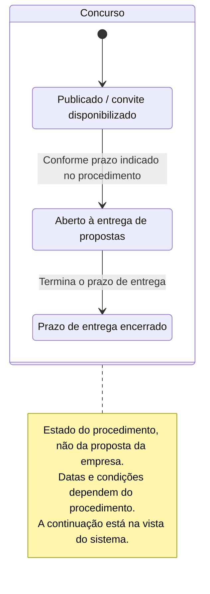
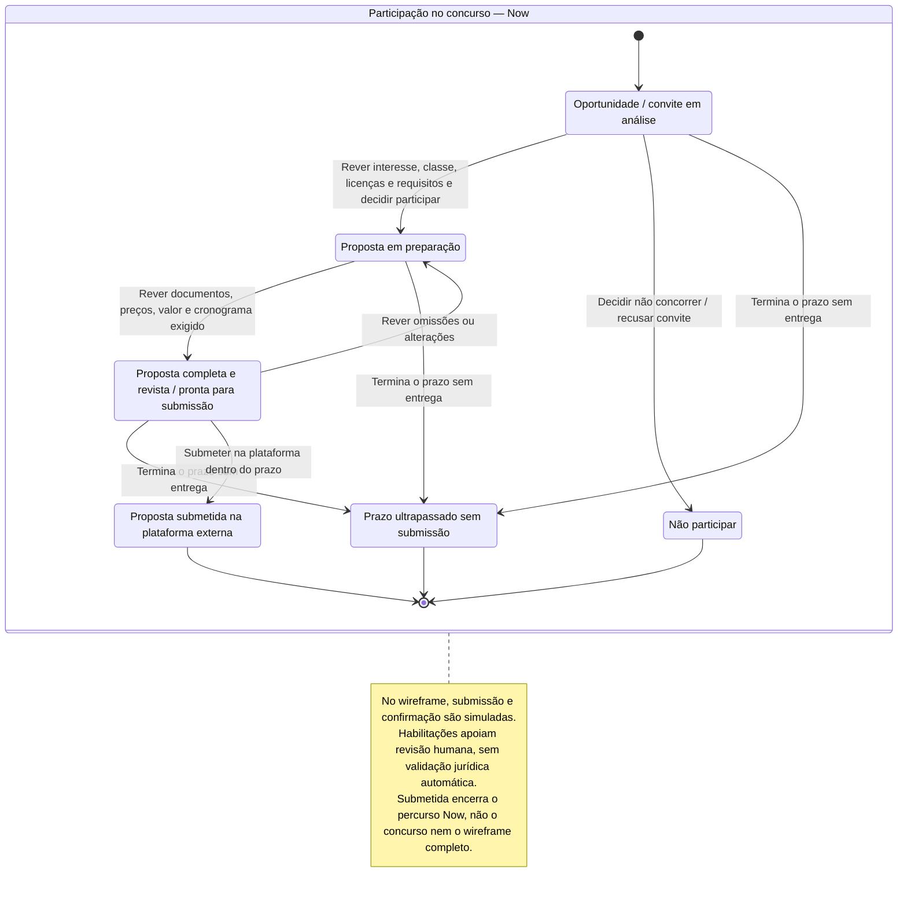
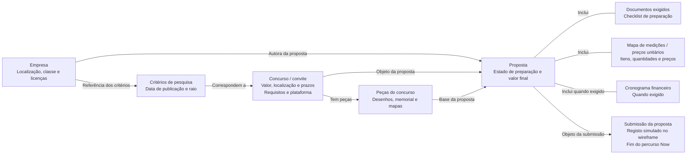

# Cairn — diagramas Now

Vistas do percurso Now: descoberta, decisão, preparação e submissão simulada. Não representam a totalidade do wireframe; consultar o [contrato completo](../system/wireframe.md).

Modelos conceptuais, não regras jurídicas validadas nem estruturas de backend já decididas. As etiquetas de prioridade pertencem à documentação, não à interface. Fontes: [T1](../transcriptions/transcricao1_gestao_obras.md) e [T2](../transcriptions/transcricao2_gestao_obras.txt).

## Entidades

Fluxo detalhado entre entidades e relações, com a mesma notação do «Percurso principal», mas incluindo conceitos de suporte e relações fora do caminho principal dentro do âmbito Now. As setas indicam relações, não ordem de execução; os passos estão em «Fluxo de trabalho».

Os conceitos são propostas de modelação derivadas das funcionalidades e entrevistas. Não fixam tabelas, cardinalidades, pertença a agregados ou campos de produção. No wireframe, os ficheiros são fictícios e as submissões simuladas; esses limites não redefinem as entidades. Sistemas externos e ferramentas aparecem num grupo distinto, ligados por linhas tracejadas; não representam integrações já disponíveis. Consultar a vista do sistema para Later e Maybe.

```mermaid
flowchart LR

    subgraph NOW["NOW — descoberta e proposta"]
        EMPRESA["Empresa participante<br/>Localização, classe e licenças declaradas"]
        PESQUISA["Critérios de pesquisa<br/>Data de publicação e raio"]
        ADJUDICANTE["Entidade adjudicante<br/>Identificação e contactos"]
        CONCURSO["Concurso / procedimento<br/>Descrição e valor anunciado<br/>Localização, prazo da obra e prazo de entrega"]
        CONVITE["Convite<br/>Destinatário, referência e informação de resposta"]
        PECAS["Peças do concurso<br/>Desenhos, memorial descritivo e mapas"]
        REQUISITO["Requisito do concurso<br/>Descrição, obrigatoriedade e informação por confirmar"]
        PARTICIPACAO["Participação da empresa<br/>Empresa × concurso<br/>Decisão e estado de acompanhamento"]
        PROPOSTA["Proposta<br/>Estado de preparação e valor proposto"]
        CHECKLIST["Item da checklist<br/>Requisito e situação de preparação"]
        DOCUMENTO["Documento da proposta<br/>Identificação e ficheiro"]
        MAPA["Mapa de medições / preços unitários"]
        ITEM["Item do mapa<br/>Descrição, unidade, quantidade e preço unitário<br/>Subtotal"]
        FINANCEIRO["Cronograma financeiro<br/>Quando exigido"]
        PERIODO["Período do cronograma<br/>Percentagem e valor previsto"]
        SUBMISSAO["Submissão da proposta<br/>Referência e confirmação de entrega"]

        EMPRESA -->|"Referência dos critérios"| PESQUISA
        PESQUISA -->|"Correspondem a"| CONCURSO
        ADJUDICANTE -->|"Entidade do procedimento"| CONCURSO
        CONCURSO -->|"Pode ter"| CONVITE
        EMPRESA -->|"Destinatária"| CONVITE
        CONCURSO -->|"Tem"| PECAS
        CONCURSO -->|"Define"| REQUISITO
        PECAS -->|"Documentam"| REQUISITO
        EMPRESA -->|"Titular"| PARTICIPACAO
        CONCURSO -->|"Objeto da participação"| PARTICIPACAO
        PARTICIPACAO -->|"Pode ter"| PROPOSTA
        PROPOSTA -->|"Inclui"| CHECKLIST
        REQUISITO -->|"Referência do item"| CHECKLIST
        CHECKLIST -->|"Pode referenciar"| DOCUMENTO
        PROPOSTA -->|"Inclui"| DOCUMENTO
        PROPOSTA -->|"Inclui"| MAPA
        MAPA -->|"Contém"| ITEM
        PROPOSTA -->|"Inclui quando exigido"| FINANCEIRO
        FINANCEIRO -->|"Contém"| PERIODO
        PROPOSTA -->|"Objeto da submissão"| SUBMISSAO
    end

    subgraph FONTES["Sistemas externos e ferramentas — contexto, não entidades de domínio"]
        DR["Diário da República"]
        IMPIC["IMPIC"]
        PLATAFORMA["Plataforma externa<br/>AcinGov / Vortal"]
        EMAIL["E-mail"]
        OFFICE["Word / Excel"]
    end

    DR -. "Fonte de anúncios; sem consulta real no wireframe" .-> CONCURSO
    IMPIC -. "Fonte referida de habilitações; acesso por validar" .-> EMPRESA
    CONCURSO -. "Plataforma indicada" .-> PLATAFORMA
    PLATAFORMA -. "Origem das peças" .-> PECAS
    PLATAFORMA -. "Origem do convite" .-> CONVITE
    EMAIL -. "Canal de aviso; simulado" .-> CONVITE
    OFFICE -. "Ferramentas atuais de preparação" .-> PROPOSTA
    SUBMISSAO -. "Destino real externo; simulado no wireframe" .-> PLATAFORMA

    style NOW fill:#eef6ee,stroke:#397647
    style FONTES fill:#eef2f6,stroke:#64748b
```

## Fluxo de trabalho

## Estados por entidade

Cada diagrama acompanha uma única entidade: Concurso e Participação. Não combina o ciclo público com as decisões de uma empresa. São modelos conceptuais baseados nas entrevistas, não regras jurídicas verificadas nem fronteiras de agregados de backend já decididas.

### Concurso

Vista do Concurso relevante para Now. O encerramento do prazo não é o fim do concurso; avaliação e contratação estão na vista do sistema. A submissão de uma empresa não altera, por si só, o estado do Concurso.

### Participação da empresa

Estado da relação entre uma empresa e um concurso, incluindo a sua proposta. Não participar ou perder o prazo encerra esta participação, não o Concurso. O diagrama não pressupõe que Participação e Proposta sejam o mesmo agregado no backend.

## Percurso principal

Fluxo entre entidades e respetivas relações, não uma sequência de tarefas. Os passos do utilizador estão no diagrama «Fluxo de trabalho».

