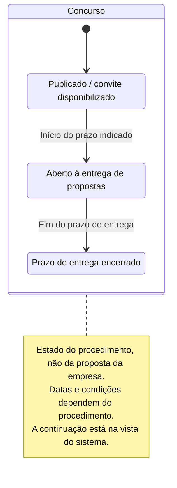
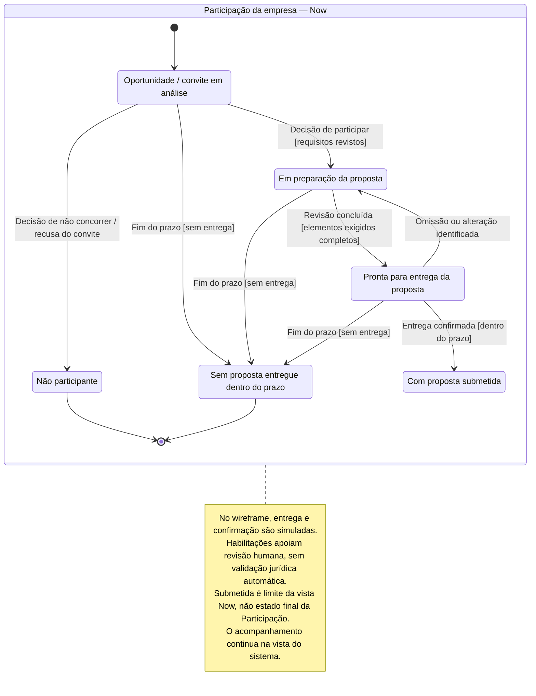
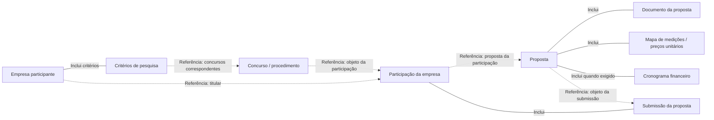

# Cairn — diagramas Now

Vistas do percurso Now: descoberta, decisão, preparação e submissão simulada. Não representam a totalidade do wireframe; consultar o [contrato completo](../system/wireframe.md).

Modelos conceptuais, não regras jurídicas validadas nem estruturas de backend já decididas. As etiquetas de prioridade pertencem à documentação, não à interface. Fontes: [T1](../transcriptions/transcricao1_gestao_obras.md) e [T2](../transcriptions/transcricao2_gestao_obras.txt). Notação e critérios de revisão: [formatos de modelação](../formats/README.md).

## Entidades

Formato [DDD de entidades e agregados](../formats/entity-aggregate-flows.md): BC, AR, entidades de suporte, VO, composição, referências e interações entre raízes. **Todas as fronteiras e interações são hipóteses**, não decisões de backend. BC é âmbito de linguagem e regras; Now/Later/Maybe são apenas metadados de prioridade.

Legenda: `🔷 AR:` raiz de agregado; `◽ E:` entidade de suporte; `▫ VO:` valor sem identidade própria. VO também aparecem como tipos de propriedades, por exemplo `VO Dinheiro`. Linhas `---` indicam composição proposta; linhas tracejadas `Referência:` indicam associações sem propriedade partilhada; setas `Evento:` ou `Pedido:` indicam colaboração proposta entre raízes. O grupo externo e os rótulos `Externo:` identificam fontes, ferramentas ou destinos, não integrações disponíveis.

A seleção de uma oportunidade é uma ação humana: o evento representado comunica essa seleção à Participação, não muda o estado público do Concurso. Submissão e confirmação são simuladas no wireframe. Eventos não pressupõem event bus, microserviços, criação automática de registos ou efeitos externos. «Aguardar decisão» permanece estado da Participação, não uma nova entidade. Nenhum BC é classificado como core domain sem validar o seu valor estratégico.

Vista Now, sem módulo de fornecedores ou planeamento da obra. As interações posteriores estão na vista do sistema.

```mermaid
flowchart LR

    subgraph BC_EMPRESAS["BC: Empresa e habilitações — hipótese | Now"]
        EMPRESA["🔷 AR: Empresa participante<br/><br/>• Localização: VO Localização<br/>• Classe e licenças declaradas"]
        PESQUISA["▫ VO: Critérios de pesquisa<br/>• Data de publicação<br/>• Raio e localização de referência"]
        EMPRESA ---|"Inclui critérios"| PESQUISA
    end

    subgraph BC_CONCURSOS["BC: Concursos — hipótese | Now"]
        CONCURSO["🔷 AR: Concurso / procedimento<br/><br/>• Descrição<br/>• Valor anunciado: VO Dinheiro<br/>• Localização: VO Localização<br/>• Prazo da obra e prazo de entrega<br/>• Estado"]
        ADJUDICANTE["▫ VO: EntidadeAdjudicanteRef<br/>• Identificação e contactos de referência"]
        CONVITE["◽ E: Convite<br/>• DestinatárioRef<br/>• Referência e informação de resposta"]
        PECAS["◽ E: Peças do concurso<br/>• Referência e versão<br/>• Desenhos, memorial descritivo e mapas"]
        REQUISITO["◽ E: Requisito do concurso<br/>• Identificação e descrição<br/>• Obrigatoriedade e informação por confirmar"]

        CONCURSO ---|"Identifica por referência"| ADJUDICANTE
        CONCURSO ---|"Inclui quando existe"| CONVITE
        CONCURSO ---|"Inclui"| PECAS
        CONCURSO ---|"Inclui"| REQUISITO
    end

    subgraph BC_PROPOSTAS["BC: Propostas e participação — hipótese | Now"]
        PARTICIPACAO["🔷 AR: Participação da empresa<br/><br/>• EmpresaRef e ConcursoRef<br/>• Decisão e estado de acompanhamento"]
        PROPOSTA["🔷 AR: Proposta<br/><br/>• ParticipaçãoRef<br/>• Estado de preparação<br/>• Valor proposto: VO Dinheiro"]
        CHECKLIST["◽ E: Item da checklist<br/>• RequisitoRef<br/>• Situação de preparação"]
        DOCUMENTO["◽ E: Documento da proposta<br/>• Identificação e ficheiro"]
        MAPA["◽ E: Mapa de medições / preços unitários<br/>• Identificação e versão"]
        ITEM["◽ E: Item do mapa<br/>• Descrição, unidade e quantidade<br/>• Preço unitário e subtotal: VO Dinheiro"]
        FINANCEIRO["◽ E: Cronograma financeiro<br/>• Identificação e versão<br/>• Quando exigido"]
        PERIODO["▫ VO: Período do cronograma<br/>• Intervalo: VO Período<br/>• Percentagem: VO Percentagem<br/>• Valor previsto: VO Dinheiro"]
        SUBMISSAO["◽ E: Submissão da proposta<br/>• PropostaRef<br/>• Referência e confirmação de entrega"]

        PARTICIPACAO ---|"Inclui"| SUBMISSAO
        PROPOSTA ---|"Inclui"| CHECKLIST
        PROPOSTA ---|"Inclui"| DOCUMENTO
        PROPOSTA ---|"Inclui"| MAPA
        MAPA ---|"Contém"| ITEM
        PROPOSTA ---|"Inclui quando exigido"| FINANCEIRO
        FINANCEIRO ---|"Contém"| PERIODO
    end

    %% Referências estruturais — não composições entre raízes
    PESQUISA -. "Referência: concursos correspondentes" .-> CONCURSO
    EMPRESA -. "Referência: destinatária" .-> CONVITE
    PECAS -. "Referência: documentam requisitos" .-> REQUISITO
    EMPRESA -. "Referência: titular" .-> PARTICIPACAO
    CONCURSO -. "Referência: objeto da participação" .-> PARTICIPACAO
    PARTICIPACAO -. "Referência: proposta da participação" .-> PROPOSTA
    REQUISITO -. "Referência: requisito do item" .-> CHECKLIST
    CHECKLIST -. "Referência: documento de preparação" .-> DOCUMENTO
    PROPOSTA -. "Referência: objeto da submissão" .-> SUBMISSAO

    %% Interações propostas — não integrações ou automatizações aprovadas
    CONCURSO -->|"Evento: OportunidadeSelecionada"| PARTICIPACAO
    PARTICIPACAO -->|"Pedido: Iniciar preparação [participar]"| PROPOSTA
    PROPOSTA -->|"Evento: PropostaPronta"| PARTICIPACAO
    PARTICIPACAO -->|"Evento: EntregaConfirmada [simulada]"| PROPOSTA

    subgraph FONTES["Sistemas externos e ferramentas — contexto"]
        DR["🌐 Diário da República"]
        IMPIC["🌐 IMPIC"]
        PLATAFORMA["🌐 Plataforma externa<br/>AcinGov / Vortal"]
        EMAIL["✉️ E-mail / telefone"]
        OFFICE["🖥️ Word / 📊 Excel"]
    end

    DR -. "Externo: origem dos anúncios; sem consulta real no wireframe" .-> CONCURSO
    IMPIC -. "Externo: fonte de habilitações; acesso por validar" .-> EMPRESA
    CONCURSO -. "Externo: plataforma indicada" .-> PLATAFORMA
    PLATAFORMA -. "Externo: origem das peças" .-> PECAS
    PLATAFORMA -. "Externo: origem do convite" .-> CONVITE
    EMAIL -. "Externo: aviso de convite; simulado" .-> CONVITE
    OFFICE -. "Externo: preparação atual" .-> PROPOSTA
    SUBMISSAO -. "Externo: destino da entrega; simulado no wireframe" .-> PLATAFORMA
```

### Hipóteses a validar

- **Empresa:** gere os dados declarados e os critérios de pesquisa; habilitações continuam a exigir revisão humana.
- **Concurso:** gere a identificação do procedimento, convite, peças e requisitos; a seleção por uma empresa não altera o seu ciclo.
- **Participação:** gere a decisão da empresa e os registos de entrega, com referências a Concurso e Proposta.
- **Proposta:** gere checklist, documentos, mapa e cronograma. Totais e completude precisam de permanecer coerentes com a versão preparada. Identidade e versionamento destes elementos ainda precisam de validação.
- **VO:** Critérios de pesquisa e Período do cronograma são valores candidatos, substituídos por valor; registos com identidade ou histórico independente exigiriam reclassificação. `EntidadeAdjudicanteRef` é o valor local que identifica/referencia a entidade pública, não a própria entidade pública nem um cadastro autónomo.
- **Coordenação:** a referência à Proposta e a entrega confirmada não tornam Participação e Proposta um agregado único. Validar revisão, concorrência e consistência entre eles antes de aprovar estas fronteiras.

## Fluxo de trabalho

Percurso da empresa participante. As ferramentas e ações externas descrevem o processo relatado; mapa, lista e preparação assistida representam a experiência proposta. No wireframe, consultas, ficheiros, entregas e confirmações usam dados fictícios ou simulação local, sem efeitos externos. Rever a proposta pressupõe reunir os elementos exigidos; os ramos de preparação não impõem uma execução paralela.

```mermaid
flowchart TD

    subgraph NOW["NOW — Início até submissão da proposta"]
        START(["Início"])
        START --> EMPRESA["Definir referência da empresa<br/>Localização, raio, classe e licenças"]
        EMPRESA --> DR["Consultar anúncios do dia no Diário da República<br/>2.ª série — contratos públicos"]
        DR --> REGIAO["Analisar obras por localização e raio da empresa<br/>Cairn proposto: mapa, lista e prazos"]
        REGIAO --> RELEVANTE{"Existe concurso relevante?"}
        RELEVANTE -- Não --> DR
        RELEVANTE -- Sim --> ANALISAR["Analisar anúncio<br/>Entidade, descrição, valor, localização e prazos"]

        START --> EMAIL["Receber aviso de convite por e-mail"]
        EMAIL --> CONVITE["Consultar convite na plataforma<br/>O e-mail é apenas um aviso"]
        CONVITE --> ANALISAR

        ANALISAR --> HABILITACAO["Verificar classe, licenças e requisitos da empresa<br/>Dados referidos: IMPIC; limites a confirmar"]
        HABILITACAO --> PARTICIPAR{"Participar?"}
        PARTICIPAR -- Não --> NAO(["Não concorrer<br/>Se houver convite, tratar recusa na plataforma"])
        PARTICIPAR -- Sim --> PLATAFORMA["Aceder à plataforma indicada<br/>AcinGov ou outra, por exemplo Vortal"]
        PLATAFORMA --> PECAS["Obter peças do concurso<br/>Desenhos, memorial descritivo, mapas e requisitos"]
        PECAS --> REQUISITOS["Rever requisitos e documentos exigidos"]

        REQUISITOS --> PREPARAR["Preparar conjunto da proposta<br/>Ferramentas atuais: Word e Excel"]
        PREPARAR --> DOCUMENTOS["Preparar documentação exigida<br/>Incluindo documentos do responsável, quando pedidos"]
        PREPARAR --> PRECOS["Preencher mapa de medições / lista de preços unitários<br/>Atribuir preço a cada item"]
        PREPARAR --> CRONOGRAMA["Preparar cronograma financeiro, quando exigido<br/>Distribuir percentagens e valores por período"]

        PRECOS --> VALOR["Definir preços unitários e calcular valor final<br/>Introduzir manualmente preços obtidos externamente<br/>Sem módulo de fornecedores nem regra fixa de margem"]

        DOCUMENTOS --> REVER["Reunir e rever a proposta<br/>Documentos, mapa preenchido, valor e cronograma exigido"]
        CRONOGRAMA --> REVER
        VALOR --> REVER
        REVER --> COMPLETA{"Proposta completa e revista?<br/>Documentos, preços e cronograma exigido"}
        COMPLETA -- Não --> PREPARAR
        COMPLETA -- Sim --> PRAZO{"Dentro do prazo de submissão?"}
        PRAZO -- Não --> EXPIRADA(["Prazo ultrapassado sem submissão"])
        PRAZO -- Sim --> SUBMETER["Submeter proposta na plataforma<br/>Ação externa; no protótipo, apenas simulação"]
        SUBMETER --> CONFIRMACAO["Consultar confirmação de entrega<br/>No wireframe, confirmação simulada"]
        CONFIRMACAO --> FIMNOW(["Fim do percurso Now<br/>Participação continua no acompanhamento"])
    end

    style NOW fill:#eef6ee,stroke:#397647
```

## Estados por entidade

Cada diagrama acompanha uma única entidade: Concurso e Participação. Não combina o ciclo público com as decisões de uma empresa. São modelos conceptuais baseados nas entrevistas, não regras jurídicas verificadas nem fronteiras de agregados de backend já decididas.

### Concurso

Vista do Concurso relevante para Now. O encerramento do prazo não é o fim do concurso; avaliação e contratação estão na vista do sistema. A submissão de uma empresa não altera, por si só, o estado do Concurso.

### Participação da empresa

Estado da relação entre uma empresa e um concurso, incluindo a sua proposta. Não participar ou perder o prazo encerra esta participação, não o Concurso. O diagrama não pressupõe que Participação e Proposta sejam o mesmo agregado no backend.

## Percurso principal

Projeção estrutural Now da vista DDD detalhada, com os mesmos nomes, composições e referências. Conforme a convenção acordada, simplifica os rótulos das caixas e omite BC, classificações, propriedades e interações; não substitui a vista DDD nem é um workflow. Critérios e elementos de preparação são valores ou entidades de suporte, não raízes adicionais. O fim visual na Submissão não encerra a Participação. Consultar o [formato do percurso principal](../formats/main-entity-flows.md).

