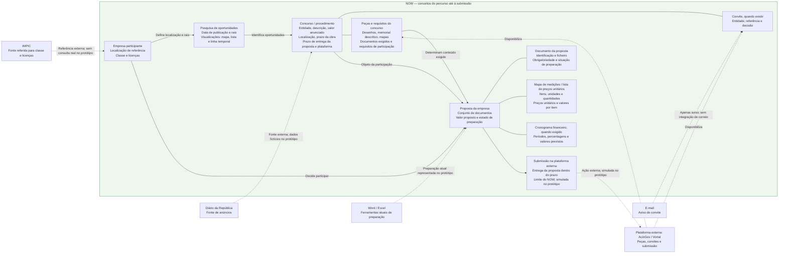
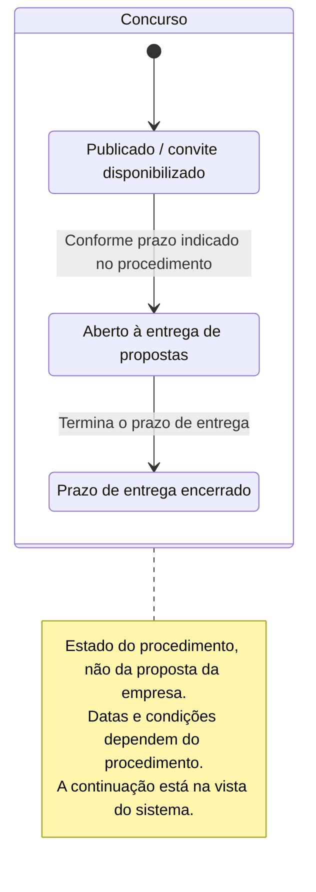
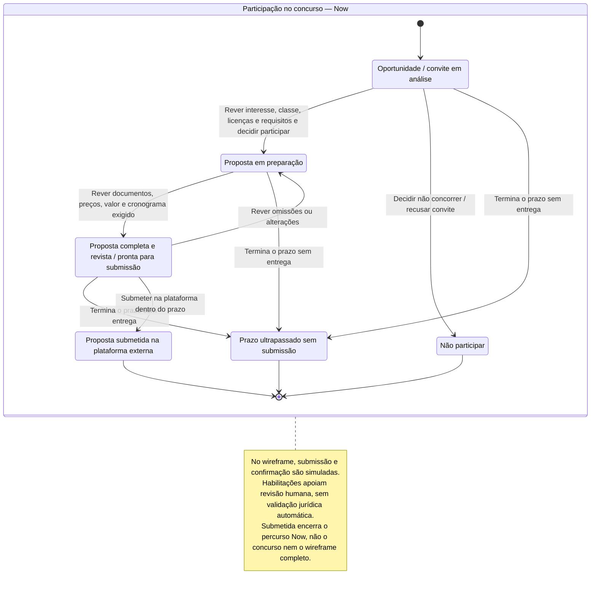
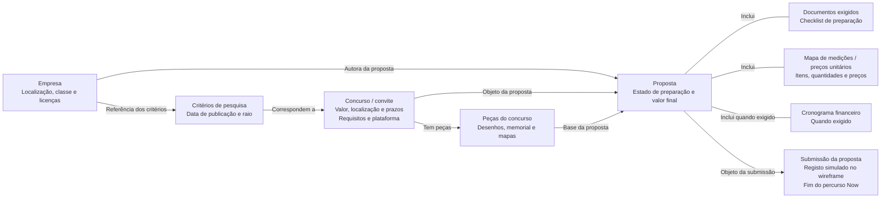

# Cairn — diagramas Now

Vistas do percurso Now: descoberta, decisão, preparação e submissão simulada. Não representam a totalidade do wireframe; consultar o [contrato completo](../system/wireframe.md).

Modelos conceptuais, não regras jurídicas validadas nem estruturas de backend já decididas. As etiquetas de prioridade pertencem à documentação, não à interface. Fontes: [T1](../transcriptions/transcricao1_gestao_obras.md) e [T2](../transcriptions/transcricao2_gestao_obras.txt).

## Entidades

## Fluxo de trabalho

```mermaid
flowchart TD

    subgraph NOW["NOW — Início até submissão da proposta"]
        START(["Início"])
        START --> EMPRESA["Definir referência da empresa<br/>Localização, raio, classe e licenças"]
        EMPRESA --> DR["Consultar anúncios do dia no Diário da República<br/>2.ª série — contratos públicos"]
        DR --> REGIAO["Analisar obras por localização e raio da empresa<br/>Cairn proposto: mapa, lista e prazos"]
        REGIAO --> RELEVANTE{"Existe concurso relevante?"}
        RELEVANTE -- Não --> DR
        RELEVANTE -- Sim --> ANALISAR["Analisar anúncio<br/>Entidade, descrição, valor, localização e prazos"]

        START --> EMAIL["Receber aviso de convite por e-mail"]
        EMAIL --> CONVITE["Consultar convite na plataforma<br/>O e-mail é apenas um aviso"]
        CONVITE --> ANALISAR

        ANALISAR --> HABILITACAO["Verificar classe, licenças e requisitos da empresa<br/>Dados referidos: IMPIC; limites a confirmar"]
        HABILITACAO --> PARTICIPAR{"Participar?"}
        PARTICIPAR -- Não --> NAO(["Não concorrer<br/>Se houver convite, tratar recusa na plataforma"])
        PARTICIPAR -- Sim --> PLATAFORMA["Aceder à plataforma indicada<br/>AcinGov ou outra, por exemplo Vortal"]
        PLATAFORMA --> PECAS["Obter peças do concurso<br/>Desenhos, memorial descritivo, mapas e requisitos"]
        PECAS --> REQUISITOS["Rever requisitos e documentos exigidos"]

        REQUISITOS --> PREPARAR["Preparar conjunto da proposta<br/>Ferramentas atuais: Word e Excel"]
        PREPARAR --> DOCUMENTOS["Preparar documentação exigida<br/>Incluindo documentos do responsável, quando pedidos"]
        PREPARAR --> PRECOS["Preencher mapa de medições / lista de preços unitários<br/>Atribuir preço a cada item"]
        PREPARAR --> CRONOGRAMA["Preparar cronograma financeiro, quando exigido<br/>Distribuir percentagens e valores por período"]

        PRECOS --> VALOR["Definir preços unitários e calcular valor final<br/>Introduzir manualmente preços obtidos externamente<br/>Sem módulo de fornecedores nem regra fixa de margem"]

        DOCUMENTOS --> REVER["Reunir e rever a proposta<br/>Documentos, mapa preenchido, valor e cronograma exigido"]
        CRONOGRAMA --> REVER
        VALOR --> REVER
        REVER --> COMPLETA{"Proposta completa e revista?<br/>Documentos, preços e cronograma exigido"}
        COMPLETA -- Não --> PREPARAR
        COMPLETA -- Sim --> PRAZO{"Dentro do prazo de submissão?"}
        PRAZO -- Não --> EXPIRADA(["Prazo ultrapassado sem submissão"])
        PRAZO -- Sim --> SUBMETER["Submeter proposta na plataforma<br/>Ação externa; no protótipo, apenas simulação"]
    end

    style NOW fill:#eef6ee,stroke:#397647
```

## Estados por entidade

Cada diagrama acompanha uma única entidade: Concurso e Participação. Não combina o ciclo público com as decisões de uma empresa. São modelos conceptuais baseados nas entrevistas, não regras jurídicas verificadas nem fronteiras de agregados de backend já decididas.

### Concurso

Vista do Concurso relevante para Now. O encerramento do prazo não é o fim do concurso; avaliação e contratação estão na vista do sistema. A submissão de uma empresa não altera, por si só, o estado do Concurso.

### Participação da empresa

Estado da relação entre uma empresa e um concurso, incluindo a sua proposta. Não participar ou perder o prazo encerra esta participação, não o Concurso. O diagrama não pressupõe que Participação e Proposta sejam o mesmo agregado no backend.

## Percurso principal

Fluxo entre entidades e respetivas relações, não uma sequência de tarefas. Os passos do utilizador estão no diagrama «Fluxo de trabalho».

