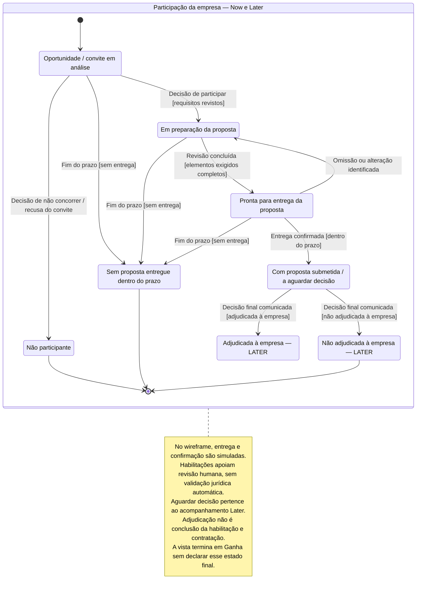
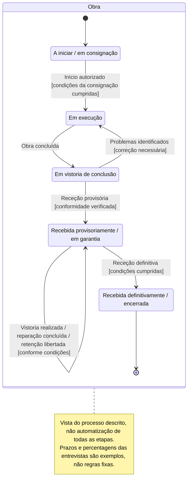
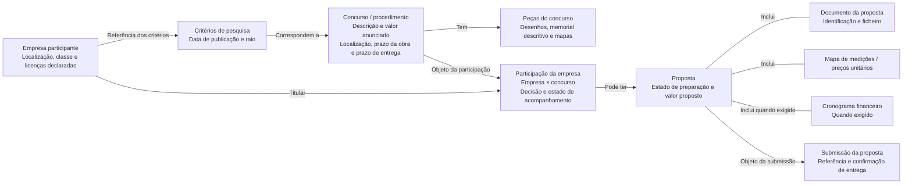

# Cairn — diagramas do sistema

Visão geral do sistema e do processo descrito nas entrevistas. As prioridades não são limites do wireframe completo. O percurso principal representa o subconjunto Now, mantido aqui como vista de contexto.

Modelos conceptuais, não regras jurídicas validadas nem estruturas de backend já decididas. As etiquetas de prioridade pertencem à documentação, não à interface. Fontes: [T1](../transcriptions/transcricao1_gestao_obras.md) e [T2](../transcriptions/transcricao2_gestao_obras.txt). Notação e critérios de revisão: [formatos de modelação](../formats/README.md).

## Entidades

Fluxo detalhado entre entidades e relações, com a mesma notação do «Percurso principal», mas incluindo conceitos de suporte e relações fora do caminho principal. As setas indicam relações, não ordem de execução; os passos estão em «Fluxo de trabalho».

Os conceitos são propostas de modelação derivadas das funcionalidades e entrevistas. Não fixam tabelas, cardinalidades, pertença a agregados ou campos de produção. No wireframe, os ficheiros são fictícios e as submissões simuladas; esses limites não redefinem as entidades. Sistemas externos e ferramentas aparecem num grupo distinto, ligados por linhas tracejadas; não representam integrações já disponíveis. Planeamento tipo Project/Gantt permanece Maybe; gestão de recursos e progresso continuam Later.

```mermaid
flowchart LR

    subgraph NOW["NOW — descoberta e proposta"]
        EMPRESA["Empresa participante<br/>Localização, classe e licenças declaradas"]
        PESQUISA["Critérios de pesquisa<br/>Data de publicação e raio"]
        ADJUDICANTE["Entidade adjudicante<br/>Identificação e contactos"]
        CONCURSO["Concurso / procedimento<br/>Descrição e valor anunciado<br/>Localização, prazo da obra e prazo de entrega"]
        CONVITE["Convite<br/>Destinatário, referência e informação de resposta"]
        PECAS["Peças do concurso<br/>Desenhos, memorial descritivo e mapas"]
        REQUISITO["Requisito do concurso<br/>Descrição, obrigatoriedade e informação por confirmar"]
        PARTICIPACAO["Participação da empresa<br/>Empresa × concurso<br/>Decisão e estado de acompanhamento"]
        PROPOSTA["Proposta<br/>Estado de preparação e valor proposto"]
        CHECKLIST["Item da checklist<br/>Requisito e situação de preparação"]
        DOCUMENTO["Documento da proposta<br/>Identificação e ficheiro"]
        MAPA["Mapa de medições / preços unitários"]
        ITEM["Item do mapa<br/>Descrição, unidade, quantidade e preço unitário<br/>Subtotal"]
        FINANCEIRO["Cronograma financeiro<br/>Quando exigido"]
        PERIODO["Período do cronograma<br/>Percentagem e valor previsto"]
        SUBMISSAO["Submissão da proposta<br/>Referência e confirmação de entrega"]

        EMPRESA -->|"Referência dos critérios"| PESQUISA
        PESQUISA -->|"Correspondem a"| CONCURSO
        ADJUDICANTE -->|"Entidade do procedimento"| CONCURSO
        CONCURSO -->|"Pode ter"| CONVITE
        EMPRESA -->|"Destinatária"| CONVITE
        CONCURSO -->|"Tem"| PECAS
        CONCURSO -->|"Define"| REQUISITO
        PECAS -->|"Documentam"| REQUISITO
        EMPRESA -->|"Titular"| PARTICIPACAO
        CONCURSO -->|"Objeto da participação"| PARTICIPACAO
        PARTICIPACAO -->|"Pode ter"| PROPOSTA
        PROPOSTA ---|"Inclui"| CHECKLIST
        REQUISITO -->|"Referência do item"| CHECKLIST
        CHECKLIST -->|"Pode referenciar"| DOCUMENTO
        PROPOSTA ---|"Inclui"| DOCUMENTO
        PROPOSTA ---|"Inclui"| MAPA
        MAPA ---|"Contém"| ITEM
        PROPOSTA ---|"Inclui quando exigido"| FINANCEIRO
        FINANCEIRO ---|"Contém"| PERIODO
        PROPOSTA -->|"Objeto da submissão"| SUBMISSAO
    end

    subgraph COMPRAS["LATER — fornecedores, cotações e materiais"]
        PROCESSO["Pedido de cotação<br/>Material / serviço e condições"]
        FORNECEDOR["Fornecedor<br/>Identificação, contactos e localização"]
        COTACAO["Cotação<br/>Preço, validade e condições"]
        MATERIAL["Material<br/>Descrição e unidade"]
        STOCK["Stock<br/>Material, quantidade e localização / obra"]

        EMPRESA -->|"Titular"| PROCESSO
        PROCESSO -->|"Destinatário"| FORNECEDOR
        PROCESSO -->|"Objeto"| MATERIAL
        PROCESSO -->|"Tem respostas"| COTACAO
        FORNECEDOR -->|"Autor da cotação"| COTACAO
        COTACAO -->|"Preço de referência para"| ITEM
        MATERIAL -->|"Objeto do registo"| STOCK
        EMPRESA -->|"Titular"| STOCK
    end

    subgraph POS_SUBMISSAO["LATER — acompanhamento e contratação"]
        AVALIACAO["Relatório de avaliação<br/>Versão preliminar / final<br/>Propostas e valores apresentados"]
        RECLAMACAO["Reclamação<br/>Referência e conteúdo"]
        ADJUDICACAO["Adjudicação / resultado<br/>Adjudicatário e valor adjudicado"]
        DOCSHAB["Documento de habilitação<br/>Empresa / responsável e prazo comunicado"]
        CONTRATO["Contrato<br/>Minuta, partes e valor"]
        CONSIGNACAO["Auto de consignação<br/>Referência, data e condições de início"]

        CONCURSO -->|"Tem relatórios"| AVALIACAO
        AVALIACAO -->|"Pode referenciar"| PROPOSTA
        PARTICIPACAO -->|"Pode ter"| RECLAMACAO
        RECLAMACAO -->|"Incide sobre"| AVALIACAO
        CONCURSO -->|"Pode ter resultado"| ADJUDICACAO
        EMPRESA -->|"Possível adjudicatária"| ADJUDICACAO
        PARTICIPACAO -->|"Pode exigir após adjudicação"| DOCSHAB
        ADJUDICACAO -->|"Base do contrato"| CONTRATO
        EMPRESA -->|"Parte contratante"| CONTRATO
        ADJUDICANTE -->|"Parte contratante"| CONTRATO
        CONTRATO -->|"Pode ter"| CONSIGNACAO
    end

    subgraph OBRA["LATER — obras, recursos e finanças"]
        O["Obra<br/>Identificação, localização, início, prazo e estado"]
        CLIENTE["Cliente<br/>Identificação e contactos"]
        FUNCIONARIO["Funcionário<br/>Identificação e informação de mão de obra"]
        EQUIPAMENTO["Equipamento<br/>Identificação e custos"]
        RECURSOS["Afetação de recursos<br/>Obra, período e custos"]
        DESPESA["Despesa da obra<br/>Descrição, data e valor"]
        FATURACAO["Registo de faturação<br/>Obra, data e valor faturado"]
        RECEBIMENTO["Recebimento<br/>Data e valor recebido"]
        PROGRESSO["Registo de progresso<br/>Item do mapa e percentagem concluída"]

        CONTRATO -->|"Contrato da obra"| O
        CONSIGNACAO -->|"Referência de início"| O
        CLIENTE -->|"Cliente da obra"| O
        O -->|"Pode ter stock"| STOCK
        O -->|"Tem afetações"| RECURSOS
        RECURSOS -->|"Pode referenciar"| FUNCIONARIO
        RECURSOS -->|"Pode referenciar"| EQUIPAMENTO
        O -->|"Tem"| DESPESA
        O -->|"Tem"| FATURACAO
        FATURACAO -->|"Pode ter recebimentos"| RECEBIMENTO
        O -->|"Tem"| PROGRESSO
        PROGRESSO -->|"Referência"| ITEM
    end

    subgraph POS_OBRA["LATER — pós-obra pública"]
        PROVISORIA["Receção provisória<br/>Referência, data e conformidade"]
        GARANTIA["Garantia da obra<br/>Condições e prazos"]
        VISTORIA["Vistoria<br/>Data e resultado"]
        REPARACAO["Reparação<br/>Problema identificado e situação"]
        RETENCAO["Retenção financeira<br/>Valor retido, condições e libertações"]
        DEFINITIVA["Receção definitiva<br/>Referência e data"]

        O -->|"Pode ter"| PROVISORIA
        O -->|"Pode ter"| GARANTIA
        O -->|"Tem registos de"| VISTORIA
        VISTORIA -->|"Pode originar"| REPARACAO
        GARANTIA -->|"Pode ter acompanhamento por"| VISTORIA
        CONTRATO -->|"Pode prever"| RETENCAO
        O -->|"Pode ter"| DEFINITIVA
    end

    subgraph VALIDAR["MAYBE — conceitos propostos, por validar"]
        PLANEAMENTO["Plano de execução<br/>Representação tipo Project / Gantt"]
        TAREFA["Tarefa do plano<br/>Datas, duração e dependências"]
        CONSULTA["Consulta assistida<br/>Pergunta, resposta fictícia e referências"]
        CONCORRENTES["Relatório de concorrência<br/>Participações, resultados, valores e localização<br/>Cobertura por confirmar"]

        O -->|"Pode ter"| PLANEAMENTO
        PLANEAMENTO -->|"Contém"| TAREFA
        TAREFA -->|"Dependência entre tarefas"| TAREFA
        CONSULTA -->|"Referência dos critérios"| PESQUISA
        CONSULTA -->|"Pode referenciar"| CONCURSO
        CONCORRENTES -->|"Pode referenciar"| CONCURSO
        CONCORRENTES -->|"Pode referenciar"| EMPRESA
    end

    subgraph FONTES["Sistemas externos e ferramentas — contexto, não entidades de domínio"]
        DR["Diário da República"]
        IMPIC["IMPIC"]
        PLATAFORMA["Plataforma externa<br/>AcinGov / Vortal"]
        EMAIL["E-mail / telefone"]
        OFFICE["Word / Excel"]
        BASE["Portal BASE"]
        SAGE["Sage / Excel"]
    end

    DR -. "Fonte de anúncios; sem consulta real no wireframe" .-> CONCURSO
    IMPIC -. "Fonte referida de habilitações; acesso por validar" .-> EMPRESA
    CONCURSO -. "Plataforma indicada" .-> PLATAFORMA
    PLATAFORMA -. "Origem das peças" .-> PECAS
    PLATAFORMA -. "Origem do convite" .-> CONVITE
    EMAIL -. "Canal de aviso; simulado" .-> CONVITE
    OFFICE -. "Ferramentas atuais de preparação" .-> PROPOSTA
    SUBMISSAO -. "Destino real externo; simulado no wireframe" .-> PLATAFORMA
    EMAIL -. "Canal atual de pedidos / respostas" .-> PROCESSO
    PLATAFORMA -. "Origem de avisos de habilitação" .-> DOCSHAB
    BASE -. "Fonte de resultados; acesso e cobertura por validar" .-> ADJUDICACAO
    BASE -. "Fonte proposta; cobertura por validar" .-> CONCORRENTES
    SAGE -. "Ferramentas atuais de gestão" .-> O
    SAGE -. "Controlo atual de garantia em Excel" .-> GARANTIA

    style NOW fill:#eef6ee,stroke:#397647
    style COMPRAS fill:#f4f4f4,stroke:#777777
    style POS_SUBMISSAO fill:#f4f4f4,stroke:#777777
    style OBRA fill:#f4f4f4,stroke:#777777
    style POS_OBRA fill:#f4f4f4,stroke:#777777
    style VALIDAR fill:#fff7e6,stroke:#a87520
    style FONTES fill:#eef2f6,stroke:#64748b
```

## Fluxo de trabalho

Processo relatado e experiência proposta, não automação já disponível. Salvo indicação de outros intervenientes, as ações são da empresa participante; abertura, avaliação e decisões da entidade adjudicante são acompanhadas pela empresa, não executadas pelo Cairn. A consulta tracejada ao BASE é auxiliar, não uma etapa obrigatória. No wireframe, consultas, ficheiros, entregas e confirmações usam dados fictícios ou simulação local, sem efeitos externos. Rever a proposta pressupõe reunir os elementos exigidos; os ramos de preparação não impõem uma execução paralela.

```mermaid
flowchart TD

    subgraph NOW["NOW — Início até submissão da proposta"]
        START(["Início"])
        START --> DR["Consultar anúncios do dia no Diário da República<br/>2.ª série — contratos públicos"]
        DR --> REGIAO["Analisar obras por localização e raio da empresa<br/>Cairn proposto: mapa, lista e prazos"]
        REGIAO --> RELEVANTE{"Existe concurso relevante?"}
        RELEVANTE -- Não --> DR
        RELEVANTE -- Sim --> ANALISAR["Analisar anúncio<br/>Entidade, descrição, valor, localização e prazos"]

        START --> EMAIL["Receber aviso de convite por e-mail"]
        EMAIL --> CONVITE["Consultar convite na plataforma<br/>O e-mail é apenas um aviso"]
        CONVITE --> ANALISAR

        ANALISAR --> HABILITACAO["Verificar classe, licenças e requisitos da empresa<br/>Dados referidos: IMPIC; limites a confirmar"]
        HABILITACAO --> PARTICIPAR{"Participar?"}
        PARTICIPAR -- Não --> NAO(["Não concorrer<br/>Se houver convite, tratar recusa na plataforma"])
        PARTICIPAR -- Sim --> PLATAFORMA["Aceder à plataforma indicada<br/>AcinGov ou outra, por exemplo Vortal"]
        PLATAFORMA --> PECAS["Obter peças do concurso<br/>Desenhos, memorial descritivo, mapas e requisitos"]
        PECAS --> REQUISITOS["Rever requisitos e documentos exigidos"]

        REQUISITOS --> PREPARAR["Preparar conjunto da proposta<br/>Ferramentas atuais: Word e Excel"]
        PREPARAR --> DOCUMENTOS["Preparar documentação exigida<br/>Incluindo documentos do responsável, quando pedidos"]
        PREPARAR --> PRECOS["Preencher mapa de medições / lista de preços unitários<br/>Atribuir preço a cada item"]
        PREPARAR --> CRONOGRAMA["Preparar cronograma financeiro, quando exigido<br/>Distribuir percentagens e valores por período"]

        PRECOS --> NECESSITA{"Necessita de preços externos?"}
        NECESSITA -- Sim --> FORNECEDORES["Pesquisar fornecedores e pedir cotações<br/>Google, telefone e e-mail; processo externo no Now"]
        FORNECEDORES --> COMPARAR["Comparar preço, condições e validade<br/>Considerar preferência por fornecedor"]
        COMPARAR --> VALOR["Definir preços unitários e calcular valor final<br/>Regra de margem por validar; sem percentagem fixa"]
        NECESSITA -- Não --> VALOR

        DOCUMENTOS --> REVER["Reunir e rever a proposta<br/>Documentos, mapa preenchido, valor e cronograma exigido"]
        CRONOGRAMA --> REVER
        VALOR --> REVER
        REVER --> COMPLETA{"Proposta completa e revista?<br/>Documentos, preços e cronograma exigido"}
        COMPLETA -- Não --> PREPARAR
        COMPLETA -- Sim --> PRAZO{"Dentro do prazo de submissão?"}
        PRAZO -- Não --> EXPIRADA(["Prazo ultrapassado sem submissão"])
        PRAZO -- Sim --> SUBMETER["Submeter proposta na plataforma<br/>Ação externa; no protótipo, apenas simulação"]
        SUBMETER --> CONFIRMACAO["Consultar confirmação de entrega<br/>No wireframe, confirmação simulada"]
    end

    subgraph LATER["Após submissão — contexto fora do NOW; suporte de produto proposto em LATER"]
        CONFIRMACAO --> ABERTURA["Acompanhar abertura das propostas<br/>Consultar concorrentes e valores na plataforma"]
        ABERTURA --> PRELIMINAR["Consultar relatório preliminar"]
        PRELIMINAR --> RECLAMACAO["Acompanhar prazo de reclamação<br/>Apresentar reclamação se necessário"]
        RECLAMACAO --> FINAL["Consultar relatório final / decisão"]
        FINAL -. "Consulta ocasional de adjudicação" .-> BASE["Consultar Portal BASE<br/>Vencedor e valor do contrato"]
        FINAL --> GANHOU{"Empresa ganhou?"}
        GANHOU -- Não --> FIMCONCURSO(["Fim da participação neste concurso"])
        GANHOU -- Sim --> DOCSHAB["Preparar e entregar documentos de habilitação<br/>Aviso por e-mail da plataforma; prazo próprio"]
        DOCSHAB --> MINUTA["Tratar minuta e contrato"]
        MINUTA --> CONSIGNACAO["Tratar auto de consignação<br/>Autoriza início da obra e do prazo de execução"]
        CONSIGNACAO --> GESTAO["Preparar gestão da obra<br/>Reunir dados dos dois Sage no Excel"]
        GESTAO --> STOCK{"Existe stock suficiente?"}
        STOCK -- Não --> COMPRAR["Obter cotações e encomendar materiais"]
        STOCK -- Sim --> USAR["Utilizar materiais existentes"]
        COMPRAR --> EXECUTAR["Executar e gerir obra<br/>Mão de obra, equipamento, materiais, custos e tarefas"]
        USAR --> EXECUTAR
        EXECUTAR --> BLOQUEIO{"Existe bloqueio ou dependência?"}
        BLOQUEIO -- Sim --> ESPERAR["Gerir entrega, tarefa anterior, secagem ou condições externas"]
        ESPERAR --> CONCLUIDA{"Obra concluída?"}
        BLOQUEIO -- Não --> CONCLUIDA
        CONCLUIDA -- Não --> EXECUTAR
        CONCLUIDA -- Sim --> VISTORIA["Realizar vistoria com empresa e entidade pública"]
        VISTORIA --> CONFORME{"Está conforme?"}
        CONFORME -- Não --> REPARAR["Reparar problemas identificados"]
        REPARAR --> VISTORIA
        CONFORME -- Sim --> PROVISORIA["Emitir receção provisória<br/>Registar data de encerramento da obra"]
        PROVISORIA --> GARANTIA["Acompanhar garantia, vistorias e prazos<br/>Atualmente em Excel; alertas propostos"]
        GARANTIA --> DEFEITO{"Defeitos identificados nas vistorias?"}
        DEFEITO -- Sim --> CORRIGIR["Reparar e voltar a verificar"]
        CORRIGIR --> GARANTIA
        DEFEITO -- Não --> RETENCAO["Pedir libertação de retenções conforme condições<br/>Percentagens e anos do exemplo não são regras fixas"]
        RETENCAO --> DEFINITIVA{"Condições para receção definitiva cumpridas?"}
        DEFINITIVA -- Não --> GARANTIA
        DEFINITIVA -- Sim --> ENCERRAR["Registar receção definitiva / encerramento"]
        ENCERRAR --> FIM(["Fim"])
    end

    style NOW fill:#eef6ee,stroke:#397647
    style LATER fill:#f4f4f4,stroke:#777777
```

## Estados por entidade

Cada diagrama acompanha uma única entidade: Concurso, Participação ou Obra. Não combina o ciclo público com as decisões de uma empresa. São modelos conceptuais baseados nas entrevistas, não regras jurídicas verificadas nem fronteiras de agregados de backend já decididas.

### Concurso

Vista parcial do percurso favorável descrito nas entrevistas, até contratação. Execução, vistorias e garantia pertencem à Obra e têm um diagrama separado. Cancelamentos e outros resultados não descritos continuam por modelar; esta sequência não é uma regra legal universal.

```mermaid
stateDiagram-v2
    state "Concurso" as Concurso {
        [*] --> Publicado
        state "Publicado / convite disponibilizado" as Publicado
        state "Aberto à entrega de propostas" as Aberto
        state "Prazo de entrega encerrado" as Encerrado

        Publicado --> Aberto: Início do prazo indicado
        Aberto --> Encerrado: Fim do prazo de entrega

        state "Em abertura de propostas" as Abertura
        state "Em avaliação preliminar" as Preliminar
        state "Em prazo de reclamação" as Reclamacao
        state "Com decisão final" as Final
        state "Em habilitação do adjudicatário" as Habilitacao
        state "Em contratação" as Contratacao
        state "Contratado" as Contratado

        Encerrado --> Abertura: Abertura das propostas pela entidade
        Abertura --> Preliminar: Início da avaliação preliminar
        Preliminar --> Reclamacao: Relatório preliminar disponibilizado
        Reclamacao --> Final: Decisão final disponibilizada [prazo terminado e reclamações tratadas]
        Final --> Habilitacao: Pedido de documentos de habilitação [adjudicação comunicada]
        Habilitacao --> Contratacao: Aceitação da documentação [documentos entregues]
        Contratacao --> Contratado: Contrato celebrado
    }

    note right of Concurso
        Estado do procedimento, não da proposta da empresa.
        Datas e condições dependem do procedimento.
        A vista termina em Contratado, sem afirmar o fim de todo o ciclo.
    end note
```

### Participação da empresa

Estado da relação entre uma empresa e um concurso, incluindo a sua proposta. Não participar ou perder o prazo encerra esta participação, não o Concurso. O diagrama não pressupõe que Participação e Proposta sejam o mesmo agregado no backend.

### Obra

Ciclo independente após contratação. A consignação inicia o percurso representado; conclusão, receções e garantia não são estados do Concurso. Vistorias e retenções surgem como eventos deste ciclo, sem pressupor entidades ou regras de backend já validadas.

## Percurso principal

Subconjunto Now da vista detalhada, com os mesmos conceitos e relações. Omite requisitos, itens da checklist e outros conceitos de suporte, mas não combina Concurso com Convite nem Documento com Item da checklist. As setas representam relações, não passos do utilizador ou fronteiras de agregados. O percurso termina visualmente na Submissão; o acompanhamento da Participação continua fora desta vista.

