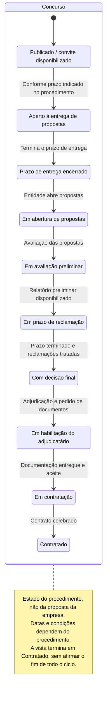
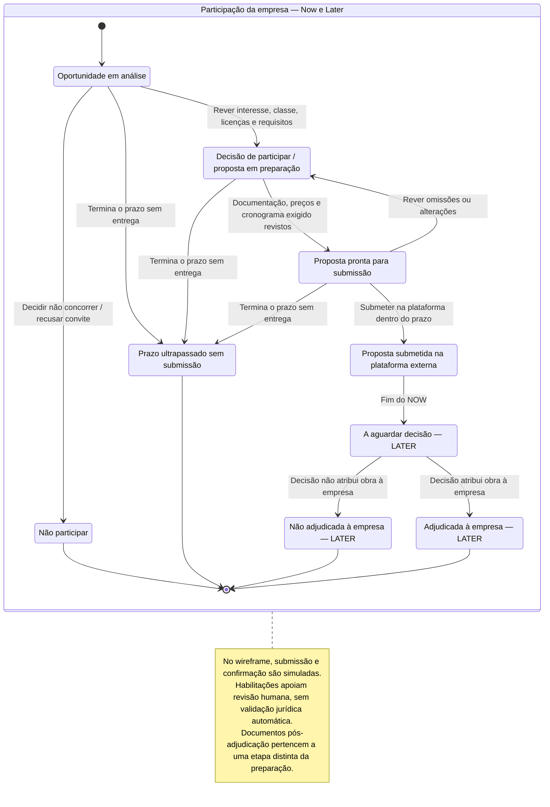
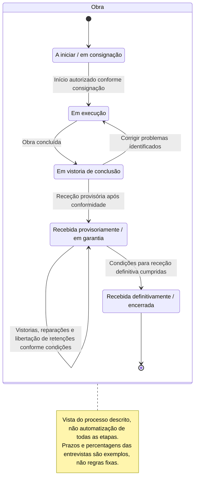
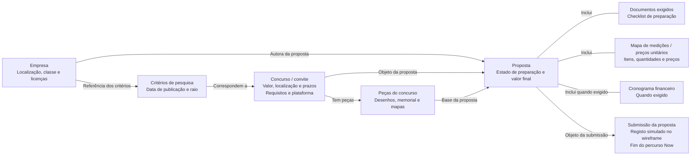

# Cairn — diagramas do sistema

Visão geral do sistema e do processo descrito nas entrevistas. As prioridades não são limites do wireframe completo. O percurso principal representa o subconjunto Now, mantido aqui como vista de contexto.

Modelos conceptuais, não regras jurídicas validadas nem estruturas de backend já decididas. As etiquetas de prioridade pertencem à documentação, não à interface. Fontes: [T1](../transcriptions/transcricao1_gestao_obras.md) e [T2](../transcriptions/transcricao2_gestao_obras.txt).

## Entidades

```mermaid
flowchart LR

    subgraph NOW["NOW — conceitos do percurso até à submissão"]
        EMPRESA["Empresa participante<br/>Localização de referência<br/>Classe e licenças"]
        PESQUISA["Pesquisa de oportunidades<br/>Data de publicação e raio<br/>Visualizações: mapa, lista e linha temporal"]
        CONCURSO["Concurso / procedimento<br/>Entidade, descrição, valor anunciado<br/>Localização, prazo da obra<br/>Prazo de entrega da proposta e plataforma"]
        CONVITE["Convite, quando existir<br/>Entidade, referência e decisão"]
        PECAS["Peças e requisitos do concurso<br/>Desenhos, memorial descritivo, mapas<br/>Documentos exigidos e requisitos de participação"]
        PROPOSTA["Proposta da empresa<br/>Conjunto de documentos<br/>Valor proposto e estado de preparação"]
        DOCUMENTO["Documento da proposta<br/>Identificação e ficheiro<br/>Obrigatoriedade e situação de preparação"]
        MAPA["Mapa de medições / lista de preços unitários<br/>Itens, unidades e quantidades<br/>Preços unitários e valores por item"]
        FINANCEIRO["Cronograma financeiro, quando exigido<br/>Períodos, percentagens e valores previstos"]
        SUBMISSAO["Submissão na plataforma externa<br/>Entrega da proposta dentro do prazo<br/>Limite do NOW; simulada no protótipo"]

        EMPRESA -->|"Define localização / capacidade a verificar"| PESQUISA
        PESQUISA -->|"Identifica oportunidades"| CONCURSO
        CONCURSO --- CONVITE
        CONCURSO --- PECAS
        EMPRESA -->|"Decide participar"| PROPOSTA
        CONCURSO -->|"Objeto da participação"| PROPOSTA
        PECAS -->|"Determinam conteúdo exigido"| PROPOSTA
        PROPOSTA --- DOCUMENTO
        PROPOSTA --- MAPA
        PROPOSTA --- FINANCEIRO
        PROPOSTA --> SUBMISSAO
    end

    subgraph COMPRAS["LATER — gestão integrada de fornecedores e cotações"]
        PROCESSO["Processo de cotação<br/>Material / serviço e pedidos"]
        FORNECEDOR["Fornecedor<br/>Nome, contactos, produtos / serviços<br/>Localização, quando conhecida"]
        COTACAO["Cotação<br/>Preço, validade e condições<br/>Fornecedor e referência do pedido"]
        PROCESSO --- COTACAO
        FORNECEDOR -->|"Responde ao pedido"| COTACAO
    end
    COTACAO -->|"Pode informar preços; processo manual externo no NOW"| MAPA

    subgraph POS_SUBMISSAO["LATER — avaliação e contratação"]
        AVALIACAO["Avaliação do procedimento<br/>Concorrentes e valores apresentados<br/>Relatórios preliminar / final e reclamações"]
        ADJUDICACAO["Resultado / adjudicação<br/>Adjudicatário e valor adjudicado"]
        DOCSHAB["Documentos de habilitação pós-adjudicação<br/>Documentos da empresa e do responsável<br/>Prazo comunicado pela plataforma"]
        CONTRATO["Minuta e contrato"]
        CONSIGNACAO["Auto de consignação<br/>Autorização de início e contagem do prazo"]
        SUBMISSAO --> AVALIACAO
        AVALIACAO --> ADJUDICACAO
        ADJUDICACAO -->|"Se adjudicado à empresa"| DOCSHAB
        DOCSHAB --> CONTRATO
        CONTRATO --> CONSIGNACAO
    end

    subgraph OBRA["LATER — gestão e execução da obra"]
        O["Obra<br/>Cliente / entidade e valor adjudicado<br/>Início, prazo, estado, despesas e recebimentos"]
        STOCK["Inventário / stock<br/>Materiais e quantidades disponíveis"]
        PLANEAMENTO["Planeamento da obra<br/>Tarefas, datas, duração, dependências<br/>Entregas, espera e condições externas"]
        RECURSOS["Afetação de recursos<br/>Funcionários, mão de obra e equipamento<br/>Obra, período e custos"]
        CONSIGNACAO --> O
        O --- STOCK
        O --- PLANEAMENTO
        O --- RECURSOS
        STOCK -->|"Stock insuficiente"| PROCESSO
        PROCESSO -->|"Encomenda de materiais"| O
    end

    subgraph POS_OBRA["LATER — pós-obra pública"]
        PROVISORIA["Receção provisória<br/>Vistoria de conclusão e conformidade<br/>Data de encerramento da obra"]
        GARANTIA["Garantia e acompanhamento<br/>Vistorias, defeitos e reparações<br/>Prazos e alertas propostos"]
        RETENCAO["Retenções financeiras<br/>Valores retidos e libertações<br/>Condições e prazos aplicáveis"]
        DEFINITIVA["Receção definitiva<br/>Encerramento do processo"]
        O -->|"Conclusão conforme após vistoria"| PROVISORIA
        PROVISORIA --> GARANTIA
        GARANTIA --- RETENCAO
        GARANTIA -->|"Condições cumpridas"| DEFINITIVA
    end

    subgraph VALIDAR["MAYBE — capacidades / cobertura a validar"]
        ASSISTENTE["Consulta em linguagem natural<br/>Dados públicos obtidos por API<br/>Disponibilidade, cobertura e comportamento por validar"]
        CONCORRENTES["Análise de empresas concorrentes<br/>Participações, vitórias, valores e localização<br/>Cobertura dos dados por confirmar"]
        ASSISTENTE -. "Apoio à pesquisa" .-> PESQUISA
        CONCORRENTES -. "Informação adicional para análise" .-> CONCURSO
    end

    DR["Diário da República<br/>Anúncios de contratos públicos"]
    IMPIC["IMPIC<br/>Classe e licenças referidas na entrevista"]
    PLATAFORMA["Plataforma externa: AcinGov / Vortal<br/>Peças, convites, submissão e avisos"]
    EMAIL["E-mail / telefone"]
    BASE["Portal BASE<br/>Consulta de contratos adjudicados"]
    OFFICE["Word / Excel<br/>Preparação atual de documentos e mapas"]
    SAGE["Dois Sage + Excel<br/>Dados antigos de mão de obra / equipamento<br/>Dados novos de materiais / faturação; consolidação manual"]

    DR -. "Fonte de anúncios; API referida, não verificada" .-> CONCURSO
    IMPIC -. "Fonte referida para habilitações" .-> EMPRESA
    PLATAFORMA -. "Disponibiliza" .-> PECAS
    PLATAFORMA -. "Disponibiliza" .-> CONVITE
    SUBMISSAO -. "Realizada fora do Cairn" .-> PLATAFORMA
    PLATAFORMA -. "Avisos de habilitação" .-> DOCSHAB
    EMAIL -. "Aviso de convite" .-> CONVITE
    EMAIL -. "Pedidos e respostas atuais" .-> PROCESSO
    BASE -. "Consulta ocasional" .-> ADJUDICACAO
    BASE -. "Fonte proposta; participações por validar" .-> CONCORRENTES
    OFFICE -. "Ferramentas atuais" .-> PROPOSTA
    SAGE -. "Gestão atual" .-> O
    SAGE -. "Controlo atual em Excel" .-> GARANTIA

    style NOW fill:#eef6ee,stroke:#397647
    style COMPRAS fill:#f4f4f4,stroke:#777777
    style POS_SUBMISSAO fill:#f4f4f4,stroke:#777777
    style OBRA fill:#f4f4f4,stroke:#777777
    style POS_OBRA fill:#f4f4f4,stroke:#777777
    style VALIDAR fill:#fff7e6,stroke:#a87520
```

## Fluxo de trabalho

```mermaid
flowchart TD

    subgraph NOW["NOW — Início até submissão da proposta"]
        START(["Início"])
        START --> DR["Consultar anúncios do dia no Diário da República<br/>2.ª série — contratos públicos"]
        DR --> REGIAO["Analisar obras por localização e raio da empresa<br/>Cairn proposto: mapa, lista e prazos"]
        REGIAO --> RELEVANTE{"Existe concurso relevante?"}
        RELEVANTE -- Não --> DR
        RELEVANTE -- Sim --> ANALISAR["Analisar anúncio<br/>Entidade, descrição, valor, localização e prazos"]

        START --> EMAIL["Receber aviso de convite por e-mail"]
        EMAIL --> CONVITE["Consultar convite na plataforma<br/>O e-mail é apenas um aviso"]
        CONVITE --> ANALISAR

        ANALISAR --> HABILITACAO["Verificar classe, licenças e requisitos da empresa<br/>Dados referidos: IMPIC; limites a confirmar"]
        HABILITACAO --> PARTICIPAR{"Participar?"}
        PARTICIPAR -- Não --> NAO(["Não concorrer<br/>Se houver convite, tratar recusa na plataforma"])
        PARTICIPAR -- Sim --> PLATAFORMA["Aceder à plataforma indicada<br/>AcinGov ou outra, por exemplo Vortal"]
        PLATAFORMA --> PECAS["Obter peças do concurso<br/>Desenhos, memorial descritivo, mapas e requisitos"]
        PECAS --> REQUISITOS["Rever requisitos e documentos exigidos"]

        REQUISITOS --> PREPARAR["Preparar conjunto da proposta<br/>Ferramentas atuais: Word e Excel"]
        PREPARAR --> DOCUMENTOS["Preparar documentação exigida<br/>Incluindo documentos do responsável, quando pedidos"]
        PREPARAR --> PRECOS["Preencher mapa de medições / lista de preços unitários<br/>Atribuir preço a cada item"]
        PREPARAR --> CRONOGRAMA["Preparar cronograma financeiro, quando exigido<br/>Distribuir percentagens e valores por período"]

        PRECOS --> NECESSITA{"Necessita de preços externos?"}
        NECESSITA -- Sim --> FORNECEDORES["Pesquisar fornecedores e pedir cotações<br/>Google, telefone e e-mail; processo externo no Now"]
        FORNECEDORES --> COMPARAR["Comparar preço, condições e validade<br/>Considerar preferência por fornecedor"]
        COMPARAR --> VALOR["Definir preços unitários e calcular valor final<br/>Regra de margem por validar; sem percentagem fixa"]
        NECESSITA -- Não --> VALOR

        DOCUMENTOS --> REVER["Reunir e rever a proposta<br/>Documentos, mapa preenchido, valor e cronograma exigido"]
        CRONOGRAMA --> REVER
        VALOR --> REVER
        REVER --> COMPLETA{"Proposta completa e revista?<br/>Documentos, preços e cronograma exigido"}
        COMPLETA -- Não --> PREPARAR
        COMPLETA -- Sim --> PRAZO{"Dentro do prazo de submissão?"}
        PRAZO -- Não --> EXPIRADA(["Prazo ultrapassado sem submissão"])
        PRAZO -- Sim --> SUBMETER["Submeter proposta na plataforma<br/>Ação externa; no protótipo, apenas simulação"]
    end

    subgraph LATER["Após submissão — contexto fora do NOW; suporte de produto proposto em LATER"]
        SUBMETER --> ABERTURA["Aguardar abertura das propostas<br/>Consultar concorrentes e valores na plataforma"]
        ABERTURA --> PRELIMINAR["Consultar relatório preliminar"]
        PRELIMINAR --> RECLAMACAO["Decorrer prazo de reclamação<br/>Apresentar reclamação se necessário"]
        RECLAMACAO --> FINAL["Consultar relatório final / decisão"]
        FINAL -. "Consulta ocasional de adjudicação" .-> BASE["Consultar Portal BASE<br/>Vencedor e valor do contrato"]
        FINAL --> GANHOU{"Empresa ganhou?"}
        GANHOU -- Não --> FIMCONCURSO(["Fim da participação neste concurso"])
        GANHOU -- Sim --> DOCSHAB["Preparar e entregar documentos de habilitação<br/>Aviso por e-mail da plataforma; prazo próprio"]
        DOCSHAB --> MINUTA["Tratar minuta e contrato"]
        MINUTA --> CONSIGNACAO["Auto de consignação<br/>Autoriza início da obra e do prazo de execução"]
        CONSIGNACAO --> GESTAO["Preparar gestão da obra<br/>Reunir dados dos dois Sage no Excel"]
        GESTAO --> STOCK{"Existe stock suficiente?"}
        STOCK -- Não --> COMPRAR["Obter cotações e encomendar materiais"]
        STOCK -- Sim --> USAR["Utilizar materiais existentes"]
        COMPRAR --> EXECUTAR["Executar e gerir obra<br/>Mão de obra, equipamento, materiais, custos e tarefas"]
        USAR --> EXECUTAR
        EXECUTAR --> BLOQUEIO{"Existe bloqueio ou dependência?"}
        BLOQUEIO -- Sim --> ESPERAR["Gerir entrega, tarefa anterior, secagem ou condições externas"]
        ESPERAR --> CONCLUIDA{"Obra concluída?"}
        BLOQUEIO -- Não --> CONCLUIDA
        CONCLUIDA -- Não --> EXECUTAR
        CONCLUIDA -- Sim --> VISTORIA["Realizar vistoria com empresa e entidade pública"]
        VISTORIA --> CONFORME{"Está conforme?"}
        CONFORME -- Não --> REPARAR["Reparar problemas identificados"]
        REPARAR --> VISTORIA
        CONFORME -- Sim --> PROVISORIA["Emitir receção provisória<br/>Registar data de encerramento da obra"]
        PROVISORIA --> GARANTIA["Acompanhar garantia, vistorias e prazos<br/>Atualmente em Excel; alertas propostos"]
        GARANTIA --> DEFEITO{"Defeitos identificados nas vistorias?"}
        DEFEITO -- Sim --> CORRIGIR["Reparar e voltar a verificar"]
        CORRIGIR --> GARANTIA
        DEFEITO -- Não --> RETENCAO["Pedir libertação de retenções conforme condições<br/>Percentagens e anos do exemplo não são regras fixas"]
        RETENCAO --> DEFINITIVA{"Condições para receção definitiva cumpridas?"}
        DEFINITIVA -- Não --> GARANTIA
        DEFINITIVA -- Sim --> ENCERRAR["Receção definitiva / encerramento"]
        ENCERRAR --> FIM(["Fim"])
    end

    style NOW fill:#eef6ee,stroke:#397647
    style LATER fill:#f4f4f4,stroke:#777777
```

## Estados por entidade

Cada diagrama acompanha uma única entidade: Concurso, Participação ou Obra. Não combina o ciclo público com as decisões de uma empresa. São modelos conceptuais baseados nas entrevistas, não regras jurídicas verificadas nem fronteiras de agregados de backend já decididas.

### Concurso

Vista parcial do percurso favorável descrito nas entrevistas, até contratação. Execução, vistorias e garantia pertencem à Obra e têm um diagrama separado. Cancelamentos e outros resultados não descritos continuam por modelar; esta sequência não é uma regra legal universal.

### Participação da empresa

Estado da relação entre uma empresa e um concurso, incluindo a sua proposta. Não participar ou perder o prazo encerra esta participação, não o Concurso. O diagrama não pressupõe que Participação e Proposta sejam o mesmo agregado no backend.

### Obra

Ciclo independente após contratação. A consignação inicia o percurso representado; conclusão, receções e garantia não são estados do Concurso. Vistorias e retenções surgem como eventos deste ciclo, sem pressupor entidades ou regras de backend já validadas.

## Percurso principal

Fluxo entre entidades e respetivas relações, não uma sequência de tarefas. Os passos do utilizador estão no diagrama «Fluxo de trabalho».

