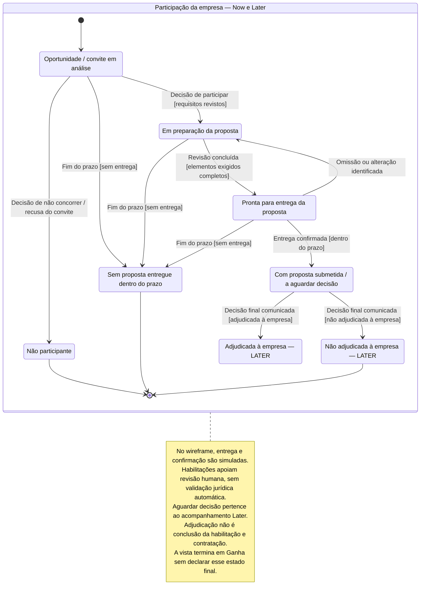
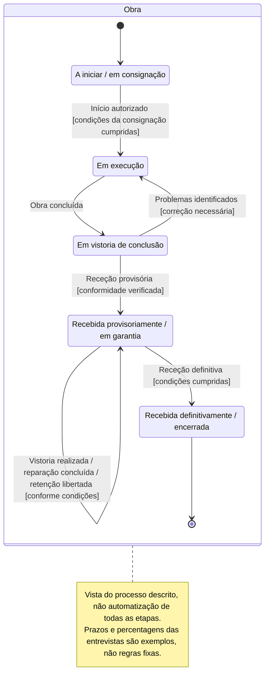
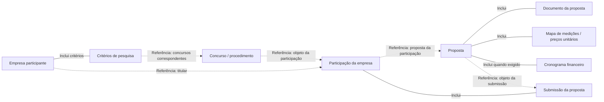

# Cairn — diagramas do sistema

Visão geral do sistema e do processo descrito nas entrevistas. As prioridades não são limites do wireframe completo. O percurso principal representa o subconjunto Now, mantido aqui como vista de contexto.

Modelos conceptuais, não regras jurídicas validadas nem estruturas de backend já decididas. As etiquetas de prioridade pertencem à documentação, não à interface. Fontes: [T1](../transcriptions/transcricao1_gestao_obras.md) e [T2](../transcriptions/transcricao2_gestao_obras.txt). Notação e critérios de revisão: [formatos de modelação](../formats/README.md).

## Entidades

Formato [DDD de entidades e agregados](../formats/entity-aggregate-flows.md): BC, AR, entidades de suporte, VO, composição, referências e interações entre raízes. **Todas as fronteiras e interações são hipóteses**, não decisões de backend. BC é âmbito de linguagem e regras; Now/Later/Maybe são apenas metadados de prioridade.

Legenda: `🔷 AR:` raiz de agregado; `◽ E:` entidade de suporte; `▫ VO:` valor sem identidade própria. VO também aparecem como tipos de propriedades, por exemplo `VO Dinheiro`. Linhas `---` indicam composição proposta; linhas tracejadas `Referência:` indicam associações sem propriedade partilhada; setas `Evento:` ou `Pedido:` indicam colaboração proposta entre raízes. O grupo externo e os rótulos `Externo:` identificam fontes, ferramentas ou destinos, não integrações disponíveis.

A seleção de uma oportunidade é uma ação humana: o evento representado comunica essa seleção à Participação, não muda o estado público do Concurso. Submissão e confirmação são simuladas no wireframe. Eventos não pressupõem event bus, microserviços, criação automática de registos ou efeitos externos. «Aguardar decisão» permanece estado da Participação, não uma nova entidade. Nenhum BC é classificado como core domain sem validar o seu valor estratégico.

A vista do sistema acrescenta contexto Later e Maybe aos mesmos conceitos Now. Planeamento tipo Project/Gantt permanece Maybe; gestão de recursos e progresso permanecem Later.

```mermaid
flowchart LR

    subgraph BC_EMPRESAS["BC: Empresa e habilitações — hipótese | Now"]
        EMPRESA["🔷 AR: Empresa participante<br/><br/>• Localização: VO Localização<br/>• Classe e licenças declaradas"]
        PESQUISA["▫ VO: Critérios de pesquisa<br/>• Data de publicação<br/>• Raio e localização de referência"]
        EMPRESA ---|"Inclui critérios"| PESQUISA
    end

    subgraph BC_CONCURSOS["BC: Concursos — hipótese | Now / Later"]
        CONCURSO["🔷 AR: Concurso / procedimento<br/><br/>• Descrição<br/>• Valor anunciado: VO Dinheiro<br/>• Localização: VO Localização<br/>• Prazo da obra e prazo de entrega<br/>• Estado"]
        ADJUDICANTE["▫ VO: EntidadeAdjudicanteRef<br/>• Identificação e contactos de referência"]
        CONVITE["◽ E: Convite<br/>• DestinatárioRef<br/>• Referência e informação de resposta"]
        PECAS["◽ E: Peças do concurso<br/>• Referência e versão<br/>• Desenhos, memorial descritivo e mapas"]
        REQUISITO["◽ E: Requisito do concurso<br/>• Identificação e descrição<br/>• Obrigatoriedade e informação por confirmar"]

        CONCURSO ---|"Identifica por referência"| ADJUDICANTE
        CONCURSO ---|"Inclui quando existe"| CONVITE
        CONCURSO ---|"Inclui"| PECAS
        CONCURSO ---|"Inclui"| REQUISITO
        AVALIACAO["◽ E: Relatório de avaliação — Later<br/>• Versão preliminar / final<br/>• Propostas e valores apresentados"]
        ADJUDICACAO["▫ VO: Resultado da adjudicação — Later<br/>• Adjudicatário: VO EmpresaRef<br/>• Valor adjudicado: VO Dinheiro"]
        CONCURSO ---|"Inclui relatórios"| AVALIACAO
        CONCURSO ---|"Inclui resultado quando existe"| ADJUDICACAO
    end

    subgraph BC_PROPOSTAS["BC: Propostas e participação — hipótese | Now / Later"]
        PARTICIPACAO["🔷 AR: Participação da empresa<br/><br/>• EmpresaRef e ConcursoRef<br/>• Decisão e estado de acompanhamento"]
        PROPOSTA["🔷 AR: Proposta<br/><br/>• ParticipaçãoRef<br/>• Estado de preparação<br/>• Valor proposto: VO Dinheiro"]
        CHECKLIST["◽ E: Item da checklist<br/>• RequisitoRef<br/>• Situação de preparação"]
        DOCUMENTO["◽ E: Documento da proposta<br/>• Identificação e ficheiro"]
        MAPA["◽ E: Mapa de medições / preços unitários<br/>• Identificação e versão"]
        ITEM["◽ E: Item do mapa<br/>• Descrição, unidade e quantidade<br/>• Preço unitário e subtotal: VO Dinheiro"]
        FINANCEIRO["◽ E: Cronograma financeiro<br/>• Identificação e versão<br/>• Quando exigido"]
        PERIODO["▫ VO: Período do cronograma<br/>• Intervalo: VO Período<br/>• Percentagem: VO Percentagem<br/>• Valor previsto: VO Dinheiro"]
        SUBMISSAO["◽ E: Submissão da proposta<br/>• PropostaRef<br/>• Referência e confirmação de entrega"]

        PARTICIPACAO ---|"Inclui"| SUBMISSAO
        PROPOSTA ---|"Inclui"| CHECKLIST
        PROPOSTA ---|"Inclui"| DOCUMENTO
        PROPOSTA ---|"Inclui"| MAPA
        MAPA ---|"Contém"| ITEM
        PROPOSTA ---|"Inclui quando exigido"| FINANCEIRO
        FINANCEIRO ---|"Contém"| PERIODO
        RECLAMACAO["◽ E: Reclamação — Later<br/>• Referência e conteúdo"]
        DOCSHAB["◽ E: Documento de habilitação — Later<br/>• Empresa / responsávelRef<br/>• Prazo comunicado"]
        PARTICIPACAO ---|"Inclui quando existe"| RECLAMACAO
        PARTICIPACAO ---|"Inclui após adjudicação quando exigido"| DOCSHAB
    end

    subgraph BC_COMPRAS["BC: Compras / Orçamentação — hipótese | Later"]
        PROCESSO["🔷 AR: Pedido de cotação<br/><br/>• EmpresaRef e MaterialRef<br/>• Serviço e condições"]
        COTACAO["◽ E: Cotação<br/>• FornecedorRef<br/>• Preço: VO Dinheiro<br/>• Validade e condições"]
        FORNECEDOR["🔷 AR: Fornecedor<br/><br/>• Identificação e contactos<br/>• Localização: VO Localização"]
        PROCESSO ---|"Inclui respostas"| COTACAO
    end

    subgraph BC_STOCK["BC: Materiais / Stock — hipótese | Later"]
        MATERIAL["🔷 AR: Material<br/><br/>• Identificação, descrição e unidade"]
        STOCK["🔷 AR: Inventário / Stock<br/><br/>• EmpresaRef<br/>• Localização / ObraRef"]
        ITEMSTOCK["◽ E: Item de stock<br/>• MaterialRef<br/>• Quantidade"]
        STOCK ---|"Inclui"| ITEMSTOCK
    end

    subgraph BC_CONTRATACAO["BC: Contratação — hipótese | Later"]
        CONTRATO["🔷 AR: Contrato<br/><br/>• ProcedimentoRef e ParticipaçãoRef<br/>• Partes, minuta e valor: VO Dinheiro"]
        CONSIGNACAO["◽ E: Auto de consignação<br/>• Referência e data<br/>• Condições de início"]
        RETENCAO["◽ E: Retenção financeira<br/>• Valor retido: VO Dinheiro<br/>• Condições e libertações"]
        CONTRATO ---|"Inclui quando existe"| CONSIGNACAO
        CONTRATO ---|"Inclui quando prevista"| RETENCAO
    end

    subgraph BC_OBRA["BC: Gestão da obra — hipótese | Later"]
        O["🔷 AR: Obra<br/><br/>• ContratoRef e ClienteRef<br/>• Identificação, localização, início, prazo e estado"]
        CLIENTE["🔷 AR: Cliente<br/><br/>• Identificação e contactos"]
        DESPESA["◽ E: Despesa da obra<br/>• Descrição, data e valor: VO Dinheiro"]
        PROGRESSO["◽ E: Registo de progresso<br/>• Item do mapaRef<br/>• Percentagem concluída: VO Percentagem"]
        PROVISORIA["◽ E: Receção provisória<br/>• Referência, data e conformidade"]
        O ---|"Inclui"| DESPESA
        O ---|"Inclui"| PROGRESSO
        O ---|"Inclui quando existe"| PROVISORIA
    end

    subgraph BC_RECURSOS["BC: Recursos — hipótese | Later"]
        RECURSOS["🔷 AR: Afetação de recursos<br/><br/>• ObraRef, FuncionárioRef e EquipamentoRef<br/>• Período: VO Período<br/>• Custos: VO Dinheiro"]
        FUNCIONARIO["🔷 AR: Funcionário<br/><br/>• Identificação e informação de mão de obra"]
        EQUIPAMENTO["🔷 AR: Equipamento<br/><br/>• Identificação e custos: VO Dinheiro"]
    end

    subgraph BC_FINANCAS["BC: Faturação e recebimentos — hipótese | Later"]
        FATURACAO["🔷 AR: Registo de faturação<br/><br/>• ObraRef e data<br/>• Valor faturado: VO Dinheiro"]
        RECEBIMENTO["◽ E: Recebimento<br/>• Data e valor recebido: VO Dinheiro"]
        FATURACAO ---|"Inclui recebimentos"| RECEBIMENTO
    end

    subgraph BC_POS_OBRA["BC: Pós-obra — hipótese | Later"]
        GARANTIA["🔷 AR: Garantia da obra<br/><br/>• ObraRef e ContratoRef<br/>• Condições e prazos"]
        VISTORIA["◽ E: Vistoria<br/>• Data e resultado"]
        REPARACAO["◽ E: Reparação<br/>• Problema identificado e situação"]
        DEFINITIVA["◽ E: Receção definitiva<br/>• Referência e data"]
        GARANTIA ---|"Inclui acompanhamento por"| VISTORIA
        GARANTIA ---|"Inclui quando necessária"| REPARACAO
        GARANTIA ---|"Inclui quando existe"| DEFINITIVA
    end

    subgraph BC_PLANEAMENTO["BC: Planeamento da obra — hipótese | Maybe"]
        PLANEAMENTO["🔷 AR: Plano de execução<br/><br/>• ObraRef<br/>• Representação tipo Project / Gantt"]
        TAREFA["◽ E: Tarefa do plano<br/>• Datas, duração e estado"]
        DEPENDENCIA["▫ VO: Dependência<br/>• Tarefa anteriorRef<br/>• Condição de espera / entrega"]
        PLANEAMENTO ---|"Inclui"| TAREFA
        TAREFA ---|"Inclui"| DEPENDENCIA
    end

    subgraph BC_CONSULTA["BC: Consulta assistida — hipótese | Maybe"]
        CONSULTA["🔷 AR: Consulta assistida<br/><br/>• Pergunta, resposta fictícia e referências"]
    end

    subgraph BC_CONCORRENCIA["BC: Análise de concorrência — hipótese | Maybe"]
        CONCORRENTES["🔷 AR: Relatório de concorrência<br/><br/>• Participações, resultados, valores e localização<br/>• Cobertura por confirmar"]
    end

    %% Referências estruturais — não composições entre raízes
    PESQUISA -. "Referência: concursos correspondentes" .-> CONCURSO
    EMPRESA -. "Referência: destinatária" .-> CONVITE
    PECAS -. "Referência: documentam requisitos" .-> REQUISITO
    EMPRESA -. "Referência: titular" .-> PARTICIPACAO
    CONCURSO -. "Referência: objeto da participação" .-> PARTICIPACAO
    PARTICIPACAO -. "Referência: proposta da participação" .-> PROPOSTA
    REQUISITO -. "Referência: requisito do item" .-> CHECKLIST
    CHECKLIST -. "Referência: documento de preparação" .-> DOCUMENTO
    PROPOSTA -. "Referência: objeto da submissão" .-> SUBMISSAO

    %% Interações propostas — não integrações ou automatizações aprovadas
    CONCURSO -->|"Evento: OportunidadeSelecionada"| PARTICIPACAO
    PARTICIPACAO -->|"Pedido: Iniciar preparação [participar]"| PROPOSTA
    PROPOSTA -->|"Evento: PropostaPronta"| PARTICIPACAO
    PARTICIPACAO -->|"Evento: EntregaConfirmada [simulada]"| PROPOSTA

    %% Referências estruturais adicionais
    EMPRESA -. "Referência: titular" .-> PROCESSO
    PROCESSO -. "Referência: destinatário" .-> FORNECEDOR
    PROCESSO -. "Referência: objeto do pedido" .-> MATERIAL
    COTACAO -. "Referência: autor da cotação" .-> FORNECEDOR
    COTACAO -. "Referência: preço de orçamento" .-> ITEM
    ITEMSTOCK -. "Referência: material armazenado" .-> MATERIAL
    EMPRESA -. "Referência: titular" .-> STOCK
    AVALIACAO -. "Referência: proposta avaliada" .-> PROPOSTA
    RECLAMACAO -. "Referência: relatório contestado" .-> AVALIACAO
    ADJUDICACAO -. "Referência: adjudicatária" .-> EMPRESA
    ADJUDICACAO -. "Referência: base do contrato" .-> CONTRATO
    EMPRESA -. "Referência: parte contratante" .-> CONTRATO
    ADJUDICANTE -. "Referência: parte contratante" .-> CONTRATO
    CONTRATO -. "Referência: contrato da obra" .-> O
    CONSIGNACAO -. "Referência: início autorizado" .-> O
    CLIENTE -. "Referência: cliente da obra" .-> O
    O -. "Referência: inventário da obra" .-> STOCK
    O -. "Referência: afetações da obra" .-> RECURSOS
    RECURSOS -. "Referência: funcionário afetado" .-> FUNCIONARIO
    RECURSOS -. "Referência: equipamento afetado" .-> EQUIPAMENTO
    O -. "Referência: faturação da obra" .-> FATURACAO
    PROGRESSO -. "Referência: item acompanhado" .-> ITEM
    O -. "Referência: garantia da obra" .-> GARANTIA
    VISTORIA -. "Referência: problema a reparar" .-> REPARACAO
    GARANTIA -. "Referência: retenção contratual" .-> RETENCAO
    O -. "Referência: plano da obra" .-> PLANEAMENTO
    DEPENDENCIA -. "Referência: tarefa anterior" .-> TAREFA
    CONSULTA -. "Referência: critérios de consulta" .-> PESQUISA
    CONSULTA -. "Referência: procedimento consultado" .-> CONCURSO
    CONCORRENTES -. "Referência: procedimento analisado" .-> CONCURSO
    CONCORRENTES -. "Referência: empresa analisada" .-> EMPRESA

    %% Interações propostas Later / Maybe, não workflow obrigatório
    PROPOSTA -->|"Pedido: Obter preços [quando necessário]"| PROCESSO
    PROCESSO -->|"Evento: CotaçõesRecebidas"| PROPOSTA
    PARTICIPACAO -->|"Evento: AdjudicaçãoComunicada [à empresa]"| CONTRATO
    CONTRATO -->|"Evento: ContratoCelebrado"| O
    O -->|"Pedido: Verificar disponibilidade de materiais"| STOCK
    STOCK -->|"Pedido: Obter cotação [stock insuficiente]"| PROCESSO
    PROCESSO -->|"Evento: FornecedorSelecionado [compra para obra]"| O
    O -->|"Pedido: Afetar recursos"| RECURSOS
    RECURSOS -->|"Evento: RecursosAfetados"| O
    O -->|"Pedido: Registar faturação"| FATURACAO
    O -->|"Evento: ReceçãoProvisóriaRegistada"| GARANTIA
    GARANTIA -->|"Pedido: Libertar retenção [condições cumpridas]"| CONTRATO
    O -->|"Pedido: Criar planeamento [Maybe]"| PLANEAMENTO
    PLANEAMENTO -->|"Evento: TarefasAtualizadas [Maybe]"| O

    subgraph FONTES["Sistemas externos e ferramentas — contexto"]
        DR["🌐 Diário da República"]
        IMPIC["🌐 IMPIC"]
        PLATAFORMA["🌐 Plataforma externa<br/>AcinGov / Vortal"]
        EMAIL["✉️ E-mail / telefone"]
        OFFICE["🖥️ Word / 📊 Excel"]
        BASE["🌐 Portal BASE"]
        SAGE["🖥️ Sage / 📊 Excel"]
    end

    DR -. "Externo: origem dos anúncios; sem consulta real no wireframe" .-> CONCURSO
    IMPIC -. "Externo: fonte de habilitações; acesso por validar" .-> EMPRESA
    CONCURSO -. "Externo: plataforma indicada" .-> PLATAFORMA
    PLATAFORMA -. "Externo: origem das peças" .-> PECAS
    PLATAFORMA -. "Externo: origem do convite" .-> CONVITE
    EMAIL -. "Externo: aviso de convite; simulado" .-> CONVITE
    OFFICE -. "Externo: preparação atual" .-> PROPOSTA
    SUBMISSAO -. "Externo: destino da entrega; simulado no wireframe" .-> PLATAFORMA
    EMAIL -. "Externo: pedidos / respostas atuais" .-> PROCESSO
    PLATAFORMA -. "Externo: avisos de habilitação" .-> DOCSHAB
    BASE -. "Externo: resultados; acesso e cobertura por validar" .-> ADJUDICACAO
    BASE -. "Externo: fonte proposta; cobertura por validar" .-> CONCORRENTES
    SAGE -. "Externo: gestão atual" .-> O
    SAGE -. "Externo: garantia atualmente em Excel" .-> GARANTIA
```

### Hipóteses a validar

- **Empresa:** gere os dados declarados e os critérios de pesquisa; revisão de habilitações permanece humana.
- **Concurso:** gere identificação, convite, peças, requisitos, relatórios e resultado. Seleção por uma empresa não altera o procedimento público.
- **Participação:** gere decisão, acompanhamento e registo de entrega, com referências a Concurso e Proposta; gere também reclamações e documentos pós-adjudicação nesta hipótese.
- **Proposta:** gere checklist, documentos, mapa, cronograma, totais e completude da versão preparada. Validar identidade, versionamento e consistência com a Participação.
- **Pedido de cotação:** gere o pedido e respostas identificáveis, com preço, validade e condições; a escolha de fornecedor não altera os dados mestres do Fornecedor.
- **Fornecedor:** gere identificação e contactos referenciados nas cotações; validar identidade, atualização e histórico dessas referências.
- **Material:** gere identificação, descrição e unidade; validar como alterações afetam referências em stock e preços.
- **Inventário / Stock:** gere itens e quantidades por localização/obra, referenciando Material. Regras de reserva e atualização concorrente ainda não estão definidas.
- **Contrato:** gere minuta, consignação e retenções previstas; regras de aceitação, alteração e libertação precisam de confirmação.
- **Obra:** gere identificação, prazo, despesa, progresso e receção provisória. Validar quais alterações precisam de consistência conjunta, sem incluir automaticamente todos os recursos e dados financeiros.
- **Cliente:** gere identificação e contactos usados pela Obra; validar se exige raiz própria ou se é apenas um papel de uma entidade já registada.
- **Afetação de recursos:** gere referências à Obra, Funcionário e Equipamento, período e custos; regras de disponibilidade e sobreposição ainda precisam de validação.
- **Funcionário:** gere identificação e informação de mão de obra, independentemente das afetações; os campos e regras de atualização não estão totalmente enumerados.
- **Equipamento:** gere identificação e informação de custos; validar identidade, disponibilidade e alterações sem incorporar as afetações.
- **Registo de faturação:** distingue montante faturado dos recebimentos; regras de conciliação e correção ainda precisam de confirmação.
- **Garantia da obra:** gere acompanhamento, vistorias, reparações e receção definitiva; referencia retenções pertencentes ao Contrato, sem propriedade dupla.
- **Plano de execução — Maybe:** gere tarefas e dependências; regras de datas, bloqueios e atualização de progresso precisam de validação.
- **Consulta assistida — Maybe:** candidata a gerir o registo de pergunta, resposta fictícia e referências; validar se precisa de identidade ou persistência própria.
- **Relatório de concorrência — Maybe:** candidato a gerir resultados e referências de uma análise; cobertura, identidade e necessidade de persistência própria ainda não estão validadas.
- **VO:** critérios, período do cronograma, resultado da adjudicação e dependência são valores candidatos. `EntidadeAdjudicanteRef` é o valor local que identifica/referencia a entidade pública, não a própria entidade pública nem um cadastro autónomo.
- **Refinamentos de modelação:** Item de stock explicita quantidades dentro do Inventário; Dependência explicita condições entre tarefas. São propostas derivadas dos conceitos existentes, não novos factos de entrevista nem novas funcionalidades.
- **Fronteiras:** todas precisam de revisão de invariantes, identidade, volume, concorrência e ciclos de vida. A notação explicita uma proposta, não promove prioridades nem confirma regras legais ou integrações.

## Fluxo de trabalho

Processo relatado e experiência proposta, não automação já disponível. Salvo indicação de outros intervenientes, as ações são da empresa participante; abertura, avaliação e decisões da entidade adjudicante são acompanhadas pela empresa, não executadas pelo Cairn. A consulta tracejada ao BASE é auxiliar, não uma etapa obrigatória. No wireframe, consultas, ficheiros, entregas e confirmações usam dados fictícios ou simulação local, sem efeitos externos. Rever a proposta pressupõe reunir os elementos exigidos; os ramos de preparação não impõem uma execução paralela.

## Estados por entidade

Cada diagrama acompanha uma única entidade: Concurso, Participação ou Obra. Não combina o ciclo público com as decisões de uma empresa. São modelos conceptuais baseados nas entrevistas, não regras jurídicas verificadas nem fronteiras de agregados de backend já decididas.

### Concurso

Vista parcial do percurso favorável descrito nas entrevistas, até contratação. Execução, vistorias e garantia pertencem à Obra e têm um diagrama separado. Cancelamentos e outros resultados não descritos continuam por modelar; esta sequência não é uma regra legal universal.

```mermaid
stateDiagram-v2
    state "Concurso" as Concurso {
        [*] --> Publicado
        state "Publicado / convite disponibilizado" as Publicado
        state "Aberto à entrega de propostas" as Aberto
        state "Prazo de entrega encerrado" as Encerrado

        Publicado --> Aberto: Início do prazo indicado
        Aberto --> Encerrado: Fim do prazo de entrega

        state "Em abertura de propostas" as Abertura
        state "Em avaliação preliminar" as Preliminar
        state "Em prazo de reclamação" as Reclamacao
        state "Com decisão final" as Final
        state "Em habilitação do adjudicatário" as Habilitacao
        state "Em contratação" as Contratacao
        state "Contratado" as Contratado

        Encerrado --> Abertura: Abertura das propostas pela entidade
        Abertura --> Preliminar: Início da avaliação preliminar
        Preliminar --> Reclamacao: Relatório preliminar disponibilizado
        Reclamacao --> Final: Decisão final disponibilizada [prazo terminado e reclamações tratadas]
        Final --> Habilitacao: Pedido de documentos de habilitação [adjudicação comunicada]
        Habilitacao --> Contratacao: Aceitação da documentação [documentos entregues]
        Contratacao --> Contratado: Contrato celebrado
    }

    note right of Concurso
        Estado do procedimento, não da proposta da empresa.
        Datas e condições dependem do procedimento.
        A vista termina em Contratado, sem afirmar o fim de todo o ciclo.
    end note
```

### Participação da empresa

Estado da relação entre uma empresa e um concurso, incluindo a sua proposta. Não participar ou perder o prazo encerra esta participação, não o Concurso. O diagrama não pressupõe que Participação e Proposta sejam o mesmo agregado no backend.

### Obra

Ciclo independente após contratação. A consignação inicia o percurso representado; conclusão, receções e garantia não são estados do Concurso. Vistorias e retenções surgem como eventos deste ciclo, sem pressupor entidades ou regras de backend já validadas.

## Percurso principal

Projeção estrutural Now da vista DDD detalhada, com os mesmos nomes, composições e referências. Conforme a convenção acordada, simplifica os rótulos das caixas e omite BC, classificações, propriedades e interações; não substitui a vista DDD nem é um workflow. Critérios e elementos de preparação são valores ou entidades de suporte, não raízes adicionais. O fim visual na Submissão não encerra a Participação. Consultar o [formato do percurso principal](../formats/main-entity-flows.md).

